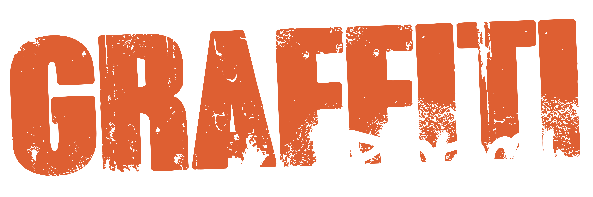
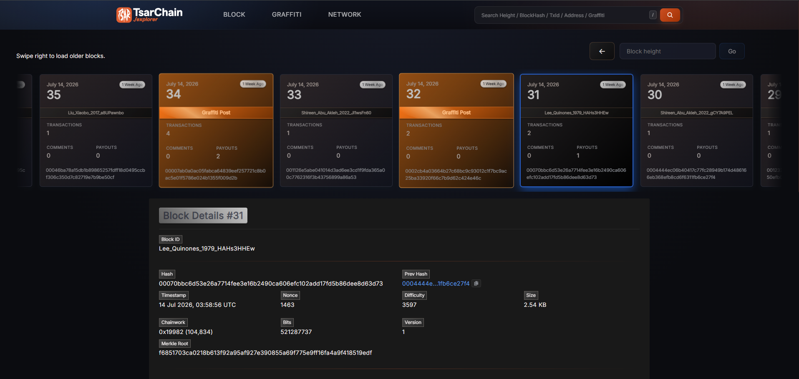
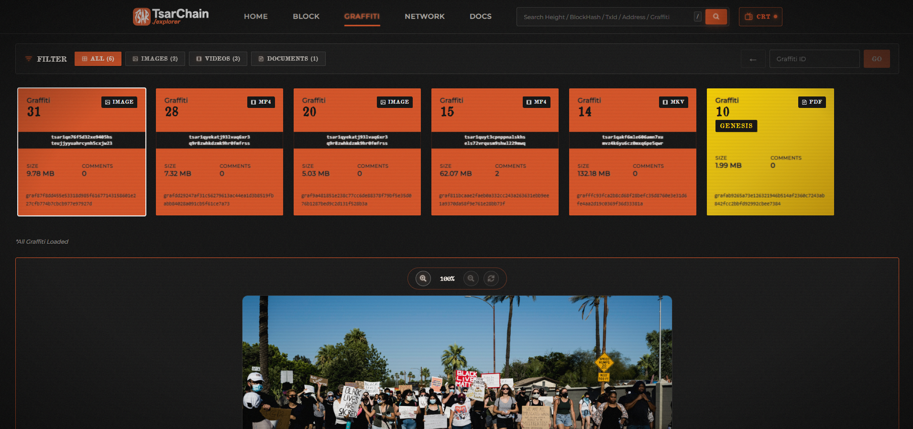

<p align="center">
  
</p>

<p align="center">
  <a href="https://github.com/Tsarstd/Graffiti-Protocol/actions/workflows/test.yml"></a>
  
  
  
  
  
  
  
  
  
</p>

# A distributed system that treats art and testimonials as primary transactions, rather than mere footnotes.

*A proof‑of‑work, UTXO‑based chain for digital preservation — durable, verifiable, and community‑owned.*

Graffiti Protocol focuses on **Voice Sovereignty**: preserving *cultural archives*, *art*, and *testimonies* so that *digital traces* don't disappear. Its decentralized architecture keeps evidence **verifiable** and **publicly auditable**, providing creative communities and cultural researchers with a durable **preservation platform**.


---

## Table of Contents
- [Demo](#️-demo)
- [Screenshots](#️-screenshots)
- [Project Status](#️-project-status)
- [Features at a Glance](#-features-at-a-glance)
- [Why Voice Sovereignty](#-why-voice-sovereignty)
- [Getting Started](#-getting-started)
- [Quickstart](#️-quickstart)
- [Config Codebase (Preview)](#️-config-codebase-preview)
- [Project & Data Structures](#️-project--data-structures)
- [Security Notes](#-security-notes)
- [Roadmap](#️-roadmap)
- [Performance Evidence](#-performance-evidence)
- [Documentation](#-documentation)
- [Contributing](CONTRIBUTING.md)
- [Security](SECURITY.md)
- [License](#-license)

---

## 🎞️ Demo

- ***Wallet (Send Tx)***
  <details>
    <summary>See Transaction demo</summary>
    
  </details>

- ***CLI Mining***
  <details>
    <summary>See Mining demo</summary>
    
  </details>

---

## 🖼️ Screenshots

- ***Wallet Tab***
  <details>
    <summary>Preview 1</summary>
    
  </details>
  <details>
    <summary>Preview 2</summary>
    
  </details>

- ***Send Tab***
  <details>
    <summary>Preview 1</summary>
    
  </details>
  <details>
    <summary>Preview 2</summary>
    
  </details>

- ***Explore Tab***
  <details>
    <summary>Preview 1</summary>
    
  </details>
  <details>
    <summary>Preview 2</summary>
    
  </details>
  <details>
    <summary>Preview 3</summary>
    
  </details>

- ***History Tab***
  <details>
    <summary>Preview 1</summary>
    
  </details>

- ***P2P Chat Tab***
  <details>
    <summary>Preview 1</summary>
    
  </details>

- ***Network Info Tab***
  <details>
    <summary>Preview 1</summary>
    
  </details>

- ***Website Explorer***
  <details>
    <summary>Preview 1</summary>
    
  </details>
  <details>
    <summary>Preview 2</summary>
    
  </details>

---

## ⚠️ Project Status

***✅ Implemented***
- **Kremlin Wallet (Light Wallet)**
  - Address generation `Bech32`
  - Address prefix `tsar1`
  - Chat Feature `X3DH & Double Ratchet`
  - Explore Tab `Exploring the Tsarchain Ecosystem`
  - Contact Management
  - History Transactions
  - Mnemonic, Private Key & Backup management for wallet
  - Post & Comment Graffiti
- **TsarChain (Consensus)**
  - Genesis Block Generating
  - Proof-of-Work `RandomX`
  - Difficulty Adjustment Consensus
  - Coinbase Reward
  - UTXO System
  - SegWit Transactions `P2WPKH`
  - Fee Mechanism
  - Mempools
  - Multi-node Networking
  - Transaction & Block Validation
  - P2P Networking Protocol
  - Chain Validation
  - Some Native Rust for acceleration module for TsarChain
- **Website Explorer**
  - Exploring Graffiti Art
  - Detail Transactions History
  - Generated History Book
  - Block Informations
- **Archivist (Storage Node)**
  - Receive Graffiti Art from Wallet
  - Proof of Retention
  - Auto Payouts based on Epoch
- **Graffiti Protocol (MVP)**
  - Graffiti upload Mechanism in Graffiti Tab `Kremlin`
  - Put a Comment and Giving a tip to graffiti creator
  - Anchoring Graffiti File Hash to Block Id
  - Comment and tip have been successfully received by the creator
  - Split incentive mechanism 80/10/10 from comment & tip
  - See Graffiti Activity in Explore Tab `Kremlin`

***🚧 In Development***
- **Archivist (Storage Node)**
  - More Consensus Security
  - Implementing resilience from rogue Archivists (slashing)
  - etc.
- **Kremlin Wallet (Light Wallet)**
  - Some UI/UX Wallet
  - improve Graffiti feature
  - etc.
- **Website Explorer**
  - More Features
  - More UI/UX Improvement
  - etc.
- **TsarChain (Consensus)**
  - Validating Graffiti Activity each node
  - Some Security
  - Some Native Rust Implemented `Pyo3`
  - etc.

---

## ✨ Features at a Glance

- **Consensus** – RandomX PoW with LWMA difficulty targeting predictable block times.
- **Ledger model** — UTXO with SegWit serialization and signature validation (secp256k1).
- **Addresses** — Bech32, prefix **`tsar1`** (P2WPKH).
- **Wallet** — “Kremlin” light wallet (GUI) for send/receive, explorer, and secure P2P chat.
- **Secure chat** — X3DH key agreement + Double Ratchet, safety numbers, and key-change alerts.
- **Networking** — Peer discovery with bootstrap support, multi-port range, full block/tx relay.
- **Observability** — Structured logs for node, miner, and wallet.
- **Graffiti Protocol** — Post, Comment & Payouts implementation ready, Proof of Retention, and Split Incentive Mechanism 80/10/10

---

## 🧭 Why Voice Sovereignty?

Platforms curate history; networks preserve it. Graffiti Protocol treats each message, artwork, or testimony as **expressive value** anchored in blocks and protected by open consensus — not for confrontation, but for the care of collective memory.

---

## 🚀 Getting Started

Graffiti Protocol provides a fully automated single-command setup script that installs all prerequisites (Rust, CMake, Node.js, Python), prepares the virtual environment, installs web & Python dependencies, and builds the Rust Native Extension.

**1. Run Setup Script**

***For Windows (PowerShell):***
Run PowerShell (preferably as Administrator for `winget`) and execute:
```powershell
.\setup.ps1
```

***For Linux / macOS (Bash):***
Open your terminal and execute:
```bash
chmod +x setup.sh
./setup.sh
```

**2. Activate Virtual Environment & PYTHONPATH**
After the setup is complete, then run:
```bash
# Windows
.\activate_env.ps1

# Linux / macOS
source activate_env.sh

# for running any application or test
```

> ⚠️ If there are any installation problems or issues regarding the Rust native extension, read the complete instructions and troubleshooting steps at: [`INSTALL_NATIVE.md`](INSTALL_NATIVE.md). For detailed information about `tsarcore_native`, see [`here`](tsarcore_native/README.md).

---

## 🏃🏻‍♂️ Quickstart

Make sure your virtual environment is activated, then run any of the applications below:

**Run a Miner/Node**
```bash
# 1. Network Initialization (Mines Block 0 & sets LMDB Genesis Lock - Bootstrap Node only)
python apps/cli_node_miner.py --init-genesis

# 2. Run full node + miner (normal mode)
python apps/cli_node_miner.py

# 3. Run node-only (no mining)
python apps/cli_node_miner.py --node-only

# Archivist Node ( Storage Node )
python apps/cli_archivist.py

# GUI Wallet
python apps/kremlin.py
```

> **Tip:** For network deployment and multi-node setup details, refer to [`docs/DEPLOYMENT.md`](docs/DEPLOYMENT.md).

---

## ⚙️ Config Codebase (Preview)

```python
# =============================================================================
# IDENTITY & NETWORK
# =============================================================================
ADDRESS_PREFIX      = "tsar"
NET_ID_DEV          = "gulag-net"

# =============================================================================
# CONSENSUS / DIFFICULTY
# =============================================================================
INITIAL_BITS       = 0x1F0FFFFF     # easier RandomX default for dev
MAX_BITS           = 0x1F0FFFFF
TARGET_BLOCK_TIME  = 37             # 37 Sec
LWMA_WINDOW        = 75             # Block's
FUTURE_DRIFT       = 600            # 10 Minute
MTP_WINDOWS        = 11             # Block's

# === Consensus Hardening ===
# CONSENSUS LIMITS (Blocks & TX)
MAX_BLOCK_BYTES         = 1_200_000        # 1,2 MB
MAX_TXS_PER_BLOCK       = 5_000
MAX_SIGOPS_PER_BLOCK    = 40_000
MAX_SIGOPS_PER_TX       = 6_000

# FORK-CHOICE & REORG
ENABLE_CHAINWORK_RULE   = True
ENABLE_REORG_LIMIT      = True
REORG_LIMIT             = 1000

# DIFF CLAMP
ENABLE_DIFF_CLAMP       = True
DIFF_CLAMP_MAX_UP       = 1.5
DIFF_CLAMP_MAX_DOWN     = 0.4

# Emergency Difficulty Adjustment (EDA)
ENABLE_EDA              = True
EDA_WINDOW              = 48
EDA_TRIGGER_RATIO       = 3.0
EDA_EASE_MULTIPLIER     = 2.0
```

> To see the entire project configuration, you can check in [`src/tsarchain/utils/config.py`](src/tsarchain/utils/config.py)

🔧 **RandomX knobs** live in the same file.Tune `RANDOMX_FULL_MEM`, `RANDOMX_LARGE_PAGES`, and `RANDOMX_KEY_EPOCH_BLOCKS` if you need lighter verification nodes or want to rotate the RandomX seed more/less frequently.
- **Dev/Test**: `RANDOMX_FULL_MEM=False`, `RANDOMX_LARGE_PAGES=False`, `RANDOMX_CACHE_MAX=1`, `RANDOMX_KEY_EPOCH_BLOCKS=64`.

---


## 🏗️ Project & Data Structures

You can look the detailed project folder tree and technical JSON schemas on architecture documentation. Please refer to the following links:

- 📁 **[Project Folder Map](docs/ARCHITECTURE.md#️-project--data-structures)** - An in-depth overview of the directory structure.
- 💸 **[Example of a Transaction Data Structure](docs/ARCHITECTURE.md#1--example-of-a-transaction-data-structure)** - JSON representation of a standard transaction.
- 🎨 **[Example of a Graffiti Activity Data Structure](docs/ARCHITECTURE.md#2--example-of-a-graffiti-activity-data-structure)** - JSON schema for post, comment, and payout activities.
- 🌐 **[Example of a State Data Structure](docs/ARCHITECTURE.md#3--example-of-a-state-data-structure)** - JSON structure of the global network state.

---

## 🔐 Security Notes

- Chat privacy uses X3DH + Double Ratchet (simple implementation).
- This is experimental software; there haven't been many network security audits, a independet project with little experience in low-level engineering.
- If you run validators/miners publicly, just **mining it!** **fork it!** **learn it!** **Look for vulnerabilities!** and see how blockchain work.
- There's no **testnet** yet, no **mainnet** yet,
- There are no promises of **riches** here.
- There are still many **bugs to fix**. If you want to test publicly, use your own private VPS.
- This project is the result of "vibe coding". for a hobby and to hone skills.

---

## 🗺️ Roadmap

- Mobile app 'Graffiti'
- The Voice Sovereignty
- and get a job 🔥

---

## 📊 Performance Evidence

Graffiti Protocol is built to be fast, responsive, and robust. I have provided raw execution logs and analysis demonstrating the benchmarks, including:
- **Sub-millisecond** RPC queries and transaction signing
- **~20ms** block validations (after initial RandomX warmup)
- Native storage integration proofs

👉 **[View Performance Evidence](docs/PERFORMANCE.md)**

---

## 📄 Documentation

##### Grungepaper
- [`Grungepaper - The Voice Sovereignty (EN)`](https://drive.google.com/file/d/1DmuYpvFHVAOSaPMMRSo1AKIOt-ZbW3BY/view?usp=drive_link)
- [`Grungepaper - The Voice Sovereignty (ID)`](https://drive.google.com/file/d/1YgTj2i-8mj_CoLMtg7dn_fpY0_WX7_GV/view?usp=drive_link)

##### Graffiti Protocol
- [`Graffiti Protocol - Draft v0.1 (EN)`](https://drive.google.com/file/d/1Xv_tr2Y0eKso62d6LPeVHBi1v8K_DF_N/view?usp=drive_link)
- [`Graffiti Protocol - Draft v0.1 (ID)`](https://drive.google.com/file/d/1nlNyPciI5Ba0HEHtmR1T-PBASyKowek1/view?usp=drive_link)

##### API
- [`API.md`](docs/API.md)

##### Deployment & Network Setup
- [`DEPLOYMENT.md`](docs/DEPLOYMENT.md)

##### Architecture
- [`ARCHITECTURE.md`](docs/ARCHITECTURE.md)

##### Rust
- [`README.md`](tsarcore_native/README.md)
- [`INSTALL_NATIVE.md`](docs/INSTALL_NATIVE.md)

##### References
- [`REFERENCES.md`](docs/REFERENCES.md)

---

## 📜 License

[`MIT`](LICENSE)
