<p align="center">
  
</p>

<p align="center">
  
  
  
  
  
  
  
  
  
</p>

# Layer 1 Blockchain - for digital preservation and voice sovereignty

*A proof‑of‑work, UTXO‑based chain for digital preservation — durable, verifiable, and community‑owned.*

TsarChain focuses on **Voice Sovereignty**: preserving *cultural archives*, *art*, and *testimonies* so that *digital traces* don't disappear. Its decentralized architecture keeps evidence **verifiable** and **publicly auditable**, providing creative communities and cultural researchers with a durable **preservation platform**.


---

## Table of Contents
- [Demo](#️-demo)
- [ScreenShoots](#️-screenshoots)
- [Project Status](#️-project-status)
  - [Implemented](#-implemented)
  - [In Development](#-in-development)
- [Features at a Glance](#-features-at-a-glance)
- [Why Voice Sovereignty](#-why-voice-sovereignty)
- [Getting Started](#-getting-started)
  - [1.Setup](#1-setup)
  - [2.Build Native Extension](#2-build-native-extension)
- [Quickstart](#️-quickstart)
- [Config Codebase (Preview)](#️-config-codebase-preview)
- [Mining Modes](#️-mining-modes)
- [Project & Data Structure's](#️-project--data-structures)
  - [Example of a Transaction Data Structure](#1--example-of-a-transaction-data-structure)
  - [Example of a Graffiti Activity Data Structure](#2--example-of-a-graffiti-activity-data-structure)
  - [Example of a State Data Structure](#3--example-of-a-state-data-structure)
- [Security Notes](#-security-notes)
- [Contributing](#-contributing)
  - [Development Support](#development-support)
- [Roadmap](#️-roadmap)
- [Documentation](#-documentation)
  - [Grungepaper](#grungepaper)
  - [Graffiti Protocol](#graffiti-protocol)
  - [Rust](#rust)
  - [Trademarks & References](#trademarks--references)
- [License](#-license)

---

## 🎞️ Demo

- ***Wallet (Send Tx)***
  <details>
    <summary>See Transaction demo</summary>
    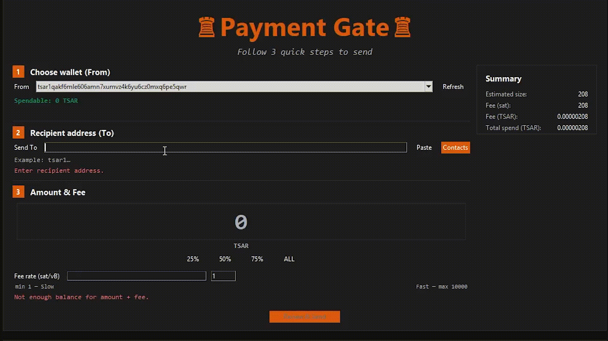
  </details>

- ***CLI Mining***
  <details>
    <summary>See Mining demo</summary>
    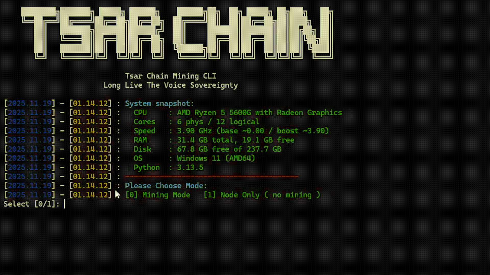
  </details>

---

## 🖼️ ScreenShoots

- ***Wallet Tab***
  <details>
    <summary>Preview 1</summary>
    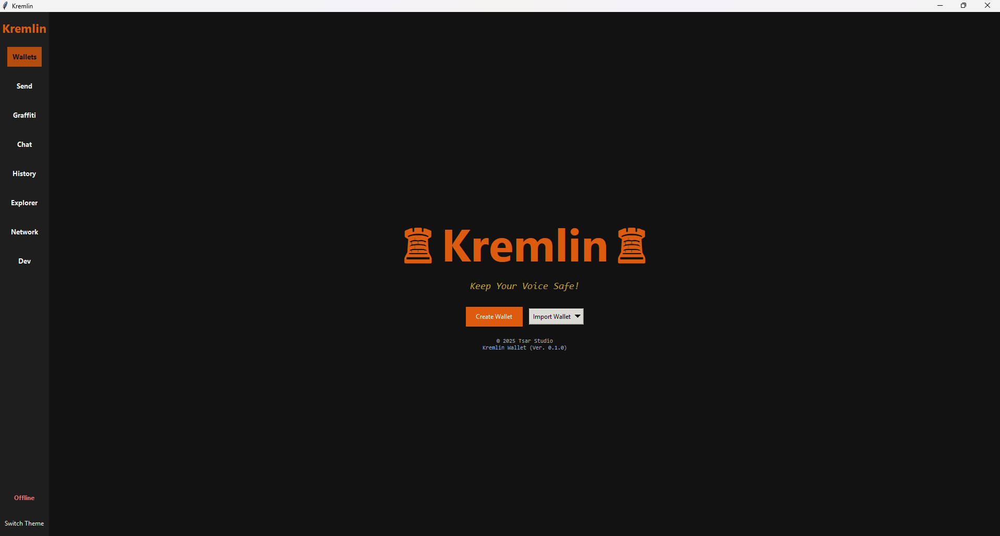
  </details>
  <details>
    <summary>Preview 2</summary>
    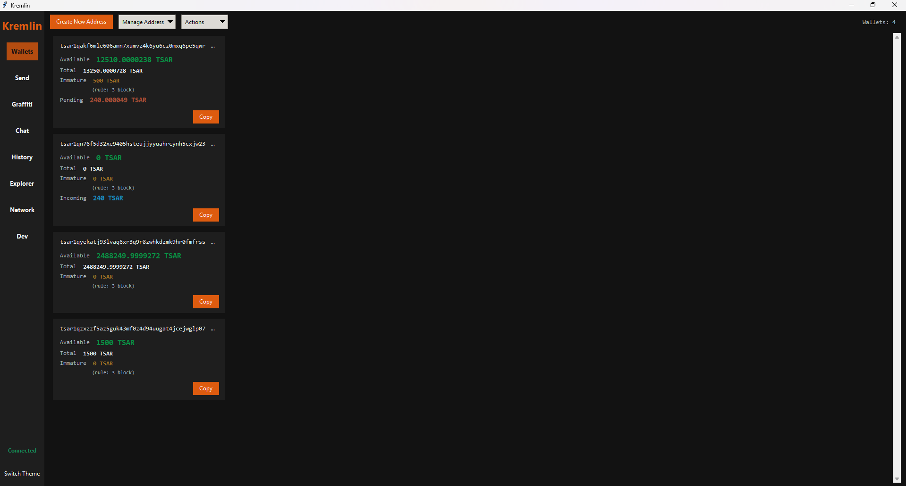
  </details>

- ***Send Tab***
  <details>
    <summary>Preview 1</summary>
    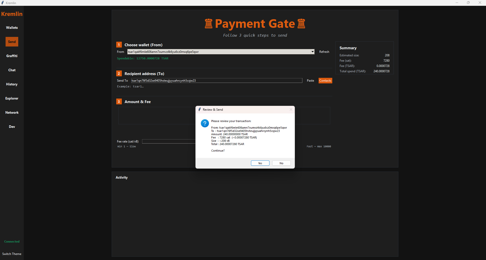
  </details>
  <details>
    <summary>Preview 2</summary>
    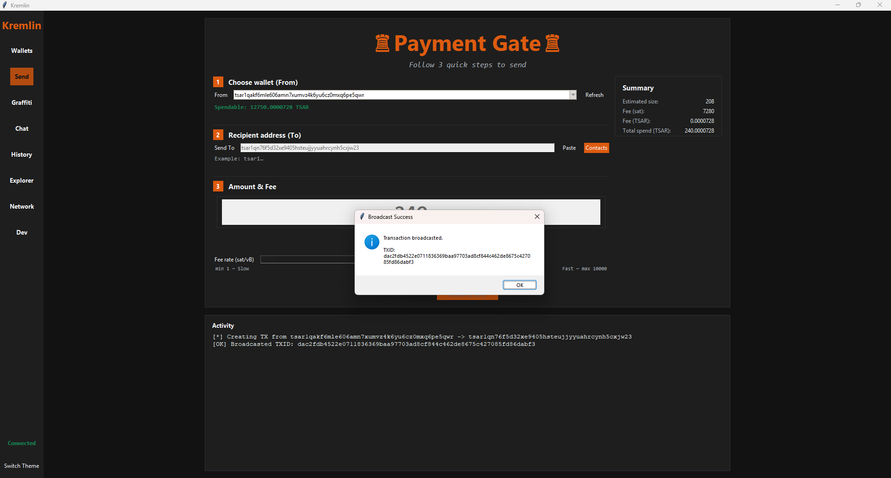
  </details>

- ***Explore Tab***
  <details>
    <summary>Preview 1</summary>
    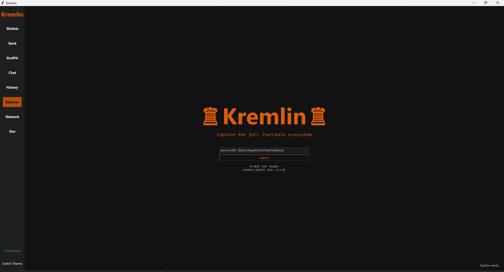
  </details>
  <details>
    <summary>Preview 2</summary>
    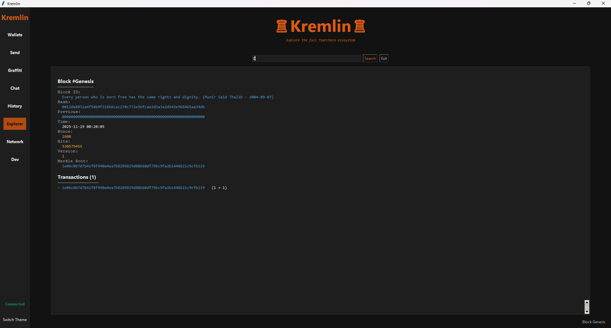
  </details>
  <details>
    <summary>Preview 3</summary>
    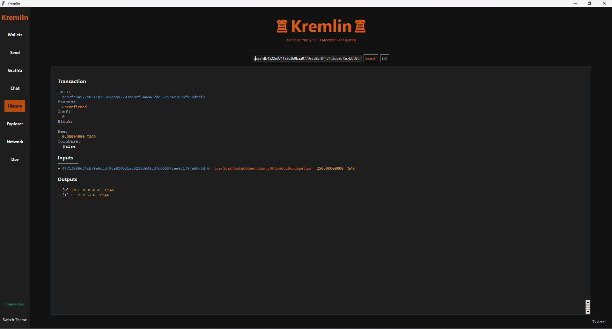
  </details>

- ***History Tab***
  <details>
    <summary>Preview 1</summary>
    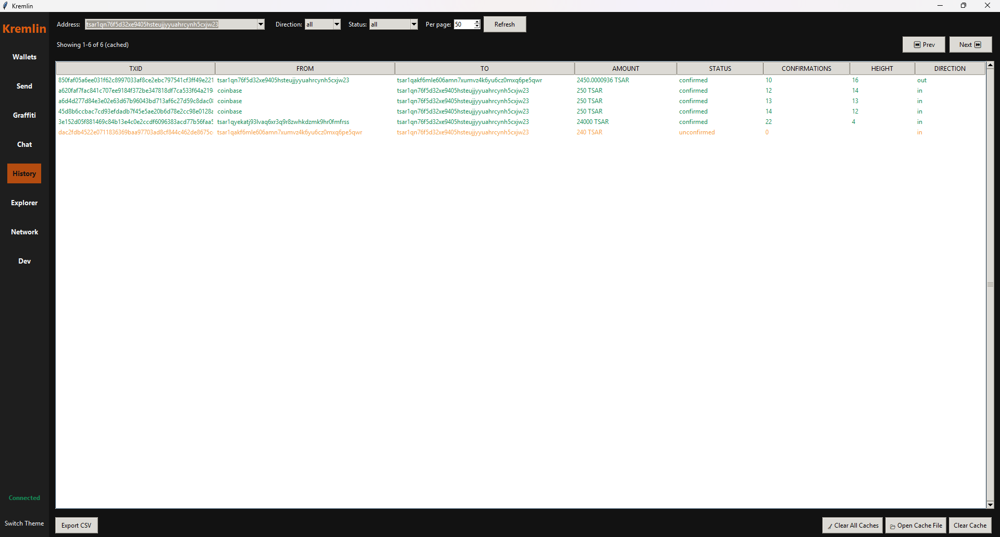
  </details>

- ***P2P Chat Tab***
  <details>
    <summary>Preview 1</summary>
    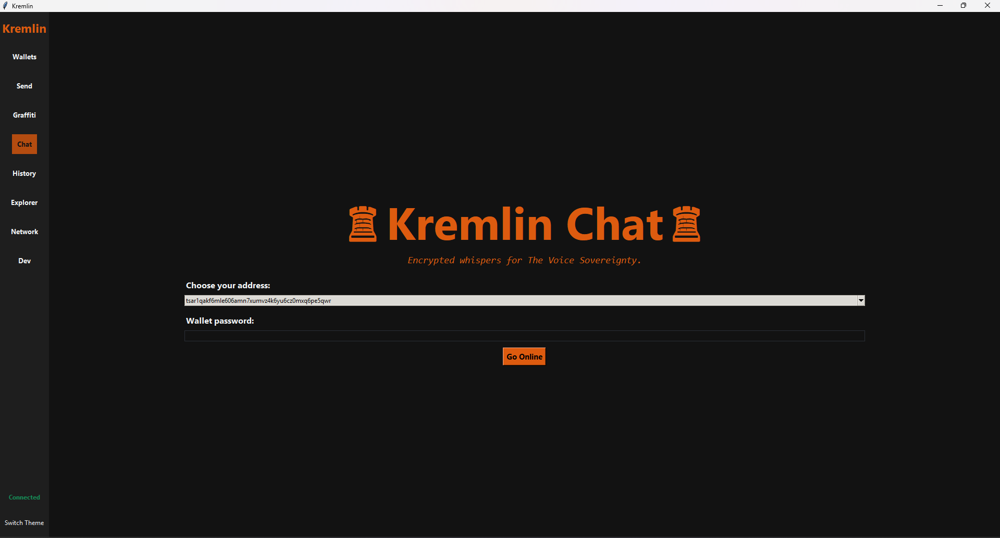
  </details>

- ***Network Info Tab***
  <details>
    <summary>Preview 1</summary>
    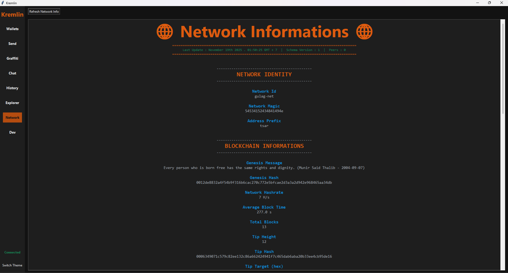
  </details>

---

## ⚠️ Project Status

#### ✅ Implemented
- **Kremlin Wallet (Light Wallet)**
  - Address generation `Bech32`
  - Address prefix `tsar1`
  - Chat Feature `X3DH & Double Ratchet`
  - Explore Tab `Exploring the Tsarchain Ecosystem`
  - Contact Management
  - History Transactions
  - Mnemonic, Private Key & Backup management for wallet
- **TsarChain (Consensus)**
  - Genesis Block Generating
  - Proof-of-Work `RandomX`
  - Difficulty Adjustment Consensus
  - Coinbase Reward
  - UTXO System
  - SegWit Transactions `P2WPKH`
  - Fee Mechanism
  - Mempools
  - Multi-node Networking
  - Transaction & Block Validation
  - P2P Networking Protocol
  - Chain Validation
  - Some Native Rust for acceleration module for TsarChain
- **Graffiti (MVP)**
  - Graffiti upload Mechanism in Graffiti Tab `Kremlin`
  - Put a Comment and Giving a tip to graffiti creator
  - Anchoring Graffiti File Hash to Block Id
  - Comment and tip have been successfully received by the creator
  - See Graffiti Activity in Explore Tab `Kremlin`

#### 🚧 In Development
- **Archivist (Storage Node)**
  - Storage Node (Proof of Retention) Payout
  - Validating Graffiti file payment status
- **Kremlin Wallet (Light Wallet)**
  - Graffiti art View `.jpg` in Kremlin Wallet
  - Some UI/UX Wallet
- **TsarChain (Consensus)**
  - Epoch Pool mechanism for Storage Node incentives
  - Some Security
  - Some Native Rust Implemented `Pyo3`
  - etc.

---

## ✨ Features at a Glance

- **Consensus** – RandomX PoW with LWMA difficulty targeting predictable block times.
- **Ledger model** — UTXO with SegWit serialization and signature validation (secp256k1).
- **Addresses** — Bech32, prefix **`tsar1`** (P2WPKH).
- **Wallet** — “Kremlin” light wallet (GUI) for send/receive, explorer, and secure P2P chat.
- **Secure chat** — X3DH key agreement + Double Ratchet, safety numbers, and key-change alerts.
- **Networking** — Peer discovery with bootstrap support, multi-port range, full block/tx relay.
- **Observability** — Structured logs for node, miner, and wallet.

---

## 🧭 Why Voice Sovereignty?

Platforms curate history; networks preserve it. TsarChain treats each message, artwork, or testimony as **expressive value** anchored in blocks and protected by open consensus — not for confrontation, but for the care of collective memory.

---

## 🚀 Getting Started

#### Requirements:
- Python ≥ 3.11, Git
- Rust toolchain for native acceleration
- CMake 3.x+

#### 1. Setup
```bash
python -m venv .venv
# Windows: .venv\Scripts\activate
source .venv/bin/activate
pip install -r requirements.txt
```

#### 2. Build Native Extension
- TsarChain `tsarcore_native` (RandomX, hashing, and some heavy routines) is built with Rust + CMake.  
- You need **CMake 3.x+** installed on your system before running `maturin develop`.
  ```bash
  # After Instaling CMake
  pip install maturin
  cd tsarcore_native
  maturin develop --release --features parallel

  # -- Run Test --
  python tests/native_test.py
  ```
  > ⚠️ If there are any installation problems or issues, read the complete instructions and troubleshooting steps at: [`INSTALL_NATIVE.md`](INSTALL_NATIVE.md)

- TsarChain always loads the Rust extension; ensure `tsarcore_native` is installed in the active environment. **see more detailed information about tsarcore_native* [`here`](tsarcore_native/README.md)

---

## 🏃🏻‍♂️ Quickstart

**Run a Miner/Node**
```bash
# GUI (lite-friendly, limited to 1 core)
python apps/miner_gui.py

# Stateless CLI miner (no on-disk blockchain, just hashing & receive ephemeral mempool)
python apps/cli_miner.py

# Full node + miner (keeps blockchain DB + snapshot gateway)
python apps/cli_node_miner.py

# GUI Wallet
python apps/kremlin.py
```

> **Tip:** For public devnet tests, lock `GENESIS_HASH`, keep `ALLOW_AUTO_GENESIS = 0`, enable the chain-work rule and reorg limits, and tune difficulty/LWMA for your network size.

---

## ⚙️ Config Codebase (Preview)

```python
# =============================================================================
# IDENTITY & NETWORK
# =============================================================================
ADDRESS_PREFIX      = "tsar"
NET_ID_DEV          = "gulag-net"

# =============================================================================
# CONSENSUS / DIFFICULTY
# =============================================================================
INITIAL_BITS       = 0x1F0FFFFF     # easier RandomX default for dev
MAX_BITS           = 0x1F0FFFFF
TARGET_BLOCK_TIME  = 60             # 60 Sec
LWMA_WINDOW        = 60             # Block's
FUTURE_DRIFT       = 600            # 10 Minute
MTP_WINDOWS        = 11             # Block's

# === Consensus Hardening ===
# CONSENSUS LIMITS (Blocks & TX)
MAX_BLOCK_BYTES         = 1_200_000        # 1,2 MB
MAX_TXS_PER_BLOCK       = 5_000
MAX_SIGOPS_PER_BLOCK    = 40_000
MAX_SIGOPS_PER_TX       = 6_000

# FORK-CHOICE & REORG
ENABLE_CHAINWORK_RULE   = True
ENABLE_REORG_LIMIT      = True
REORG_LIMIT             = 1000

# DIFF CLAMP
ENABLE_DIFF_CLAMP       = True
DIFF_CLAMP_MAX_UP       = 1.5
DIFF_CLAMP_MAX_DOWN     = 0.4

# Emergency Difficulty Adjustment (EDA)
ENABLE_EDA              = True
EDA_WINDOW              = 48
EDA_TRIGGER_RATIO       = 3.0
EDA_EASE_MULTIPLIER     = 2.0
```

> To see the entire project configuration, you can check in [`src/tsarchain/utils/config.py`](src/tsarchain/utils/config.py)

🔧 **RandomX knobs** live in the same file.Tune `RANDOMX_FULL_MEM`, `RANDOMX_LARGE_PAGES`, and `RANDOMX_KEY_EPOCH_BLOCKS` if you need lighter verification nodes or want to rotate the RandomX seed more/less frequently.
- **Dev/Test**: `RANDOMX_FULL_MEM=False`, `RANDOMX_LARGE_PAGES=False`, `RANDOMX_CACHE_MAX=1`, `RANDOMX_KEY_EPOCH_BLOCKS=64`.

---

## ⛏️ Mining Modes

- **GUI Miner (`apps/miner_gui.py`)** ships with Lite GUI mode enabled and limits RandomX to one core by default so the Tkinter UI stays responsive.
- **Stateless CLI Miner (`apps/cli_miner.py`)** keeps chain data in-memory, fetches the latest tip from peers, ephemeral mempool, mines, then broadcasts (no snapshots or DB).
- **Full Node CLI Miner (`apps/cli_node_miner.py`)** persists the entire blockchain, handles snapshot bootstrap, wallet gateway traffic, and can run `--node-only` for infra roles.

Use the GUI for monitoring log, `cli_miner.py` for raw hash power, and `cli_node_miner.py` when you need full-node responsibilities.

---

## 🏗️ Project & Data Structure's

```
TsarChain/
├── apps/                    # Entry points (Executable)
│   ├── archivist.py         # Storage Node (Archivist)
│   ├── cli_miner.py         # Miner CLI (Stateless)
│   ├── cli_node_miner.py    # Miner CLI (Full Node)
│   ├── kremlin.py           # Wallet GUI (Kremlin Wallet)
│   └── miner_gui.py         # Miner GUI (Tkinter)
│
├── assets/                  # Logo, img, etc.
├── docs/                    # Documentation, Whitepaper & Draft Protocol
├── scripts/                 # Development utility scripts
├── src/
│   └── tsarchain/           # Python main packages
│       ├── consensus/       # Blockchain Logic (PoW, Difficulty, Validation, etc.)
│       ├── contracts/       # Smart Contracts (Graffiti) & Archivist Module
│       ├── core/            # Core data structure (Block, Transaction, Coinbase)
│       ├── mempool/         # MemPool Management & Policy
│       ├── network/         # P2P Networking, RPC, & Gossip Protocol
│       ├── storage/         # Database Layer (LMDB/JSON mode & UTXO)
│       ├── utils/           # Global Configurations (config.py) & Helper
│       └── wallet/          # Wallet Logic, Security, & UI Components
│
├── tests/                   # Unit testing (native & double rachet)
├── tools/                   # LMDB database tools & Snapshot maintenance
└── tsarcore_native/         # Native Module (Rust + PyO3)
    └── src/                 # Source code Rust (lib.rs, networking.rs, validation.rs, storage.rs)
```
#### 1. 💸 Example of a Transaction Data Structure
The example data of `block, utxo's & mempool` below, shows a transaction :
> address `tsar1qzxzzf5az5guk43mf0z4d94uugat4jcejwglp07` sent 800 coins + 0,00006300 fee to address`tsar1qn76f5d32xe9405hsteujjyyuahrcynh5cxjw23`,
then validated by miner `tsar1qyekatj93lvaq6xr3q9r8zwhkdzmk9hr0fmfrss` in block height 6
- ***Block Data Structure (.json):***
  <details>
    <summary>See Preview</summary>

  ```json
    {
      "_meta": {
        "bits": 522190847,
        "chainwork": 14336,
        "comment_count": 0,
        "comments": [],
        "difficulty": 2048,
        "graffiti": [],
        "graffiti_post_count": 0,
        "hash": "001144e85e6612772663760a519eb8d4aeb1d8bd34fbf2b9d32dd99b901d476a",
        "height": 6,
        "merkle_root": "b1c473c9372ed27bdb00a9ce0840bd7765f8175347a6d52f7683db88673d14ed",
        "nonce": 1413,
        "prev_block_hash": "0011103c1311c22c629f2d05fe05f3cbb63eb66ac0f498ae200a803e0c054f12",
        "schema_version": 1,
        "size_bytes": 1669,
        "target": 5.653907911296163e73,
        "timestamp": 1764112364,
        "tx_count": 2,
        "vbytes": 1669,
        "version": 1,
        "weight": 6676
      },
      "bits": 522190847,
      "hash": "001144e85e6612772663760a519eb8d4aeb1d8bd34fbf2b9d32dd99b901d476a",
      "height": 6,
      "merkle_root": "b1c473c9372ed27bdb00a9ce0840bd7765f8175347a6d52f7683db88673d14ed",
      "nonce": 1413,
      "prev_block_hash": "0011103c1311c22c629f2d05fe05f3cbb63eb66ac0f498ae200a803e0c054f12",
      "timestamp": 1764112364,
      "transactions": [
        {
          "block_id": "Ai_Weiwei_2011_bV2RuWnkj",
          "fee": 0,
          "height": 6,
          "inputs": [
            {
              "amount": 0,
              "script_sig": "01061841695f5765697765695f323031315f6256325275576e6b6a",
              "txid": "0000000000000000000000000000000000000000000000000000000000000000",
              "vout": 4294967295,
              "witness": []
            }
          ],
          "is_coinbase": true,
          "locktime": 0,
          "outputs": [
            {
              "amount": 25000006300,
              "script_pubkey": "0014266dd5c8b1fb3a0d18710146713af668b762dc6f"
            }
          ],
          "reward": 25000006300,
          "to_address": "tsar1qyekatj93lvaq6xr3q9r8zwhkdzmk9hr0fmfrss",
          "txid": "7297a1ad705ace269d5961645bd4e769e1360fd2eb03913309b59410523fd057",
          "type": "Coinbase",
          "version": 1
        },
        {
          "fee": 6300,
          "inputs": [
            {
              "amount": 1200000000000,
              "script_sig": "",
              "txid": "eeaa5304e4b3ee8fb51e69765c5d42fa43fbf8930fe3376f8bf403a9a28102c5",
              "vout": 0,
              "witness": [
                "304402205784c27abddf8e29d0cc337358973dd7b125f7aa33a030d7246a9caa5427586802201e9c3c472c3cbd3fc1a3d5480363917fd06c2c83200a5049b918ce7d08d1108d01",
                "0359c3eab29ad7feb9fad33caae30e9e7a9bbbc1291748a851bb1e6d3bc81c0143"
              ]
            }
          ],
          "is_coinbase": false,
          "locktime": 0,
          "outputs": [
            {
              "amount": 80000000000,
              "script_pubkey": "00149fb49a362a364b57d2f05e7929109cedc7824ef4"
            },
            {
              "amount": 1119999993700,
              "script_pubkey": "0014118424d3a2a2396ac76978aad2d79c4757596332"
            }
          ],
          "txid": "8257f8942b0b97220dd9a14f2473e6e82324266f4f16194c7a7561e643e93e77",
          "version": 1
        }
      ],
      "version": 1
    }
  ```
  </details>

- ***UTXO's Data Structure (.json):***
  <details>
    <summary>See Preview</summary>

  ```json
    "7297a1ad705ace269d5961645bd4e769e1360fd2eb03913309b59410523fd057:0": {
      "address": "tsar1qyekatj93lvaq6xr3q9r8zwhkdzmk9hr0fmfrss",
      "block_height": 6,
      "is_coinbase": true,
      "script_type": "p2wpkh",
      "tx_out": {
        "amount": 25000006300,
        "script_pubkey": "0014266dd5c8b1fb3a0d18710146713af668b762dc6f"
      }
    },
    "8257f8942b0b97220dd9a14f2473e6e82324266f4f16194c7a7561e643e93e77:0": {
      "address": "tsar1qn76f5d32xe9405hsteujjyyuahrcynh5cxjw23",
      "block_height": 6,
      "is_coinbase": false,
      "script_type": "p2wpkh",
      "tx_out": {
        "amount": 80000000000,
        "script_pubkey": "00149fb49a362a364b57d2f05e7929109cedc7824ef4"
      }
    },
    "8257f8942b0b97220dd9a14f2473e6e82324266f4f16194c7a7561e643e93e77:1": {
      "address": "tsar1qzxzzf5az5guk43mf0z4d94uugat4jcejwglp07",
      "block_height": 6,
      "is_coinbase": false,
      "script_type": "p2wpkh",
      "tx_out": {
        "amount": 1119999993700,
        "script_pubkey": "0014118424d3a2a2396ac76978aad2d79c4757596332"
      }
    }
  ```
  </details>

- ***MemPool Data Structure (.json):***
  <details>
    <summary>See Preview</summary>

  ```json
  {
    "meta": {
      "count": 1,
      "generated_at": 1764112250,
      "max_size_bytes": 1048576,
      "schema_version": 1,
      "virtual_size": 204
    },
    "schema_version": 1,
    "txs": [
      {
        "_meta": {
          "fee_rate": 30.88235294117647,
          "received_at": 1764112250.2801704,
          "schema_version": 1,
          "vbytes": 204,
          "weight": 816
        },
        "fee": 6300,
        "inputs": [
          {
            "amount": 1200000000000,
            "script_sig": "",
            "txid": "eeaa5304e4b3ee8fb51e69765c5d42fa43fbf8930fe3376f8bf403a9a28102c5",
            "vout": 0,
            "witness": [
              "304402205784c27abddf8e29d0cc337358973dd7b125f7aa33a030d7246a9caa5427586802201e9c3c472c3cbd3fc1a3d5480363917fd06c2c83200a5049b918ce7d08d1108d01",
              "0359c3eab29ad7feb9fad33caae30e9e7a9bbbc1291748a851bb1e6d3bc81c0143"
            ]
          }
        ],
        "is_coinbase": false,
        "locktime": 0,
        "outputs": [
          {
            "amount": 80000000000,
            "script_pubkey": "00149fb49a362a364b57d2f05e7929109cedc7824ef4"
          },
          {
            "amount": 1119999993700,
            "script_pubkey": "0014118424d3a2a2396ac76978aad2d79c4757596332"
          }
        ],
        "txid": "8257f8942b0b97220dd9a14f2473e6e82324266f4f16194c7a7561e643e93e77",
        "version": 1
      }
    ]
  }
  ```
  </details>

#### 2. 🎨 Example of a Graffiti Activity Data Structure
The example data of `block (height 12), block (height 17) metadata & indexer` below, shows a graffiti activity :
> creator `tsar1qzxzzf5az5guk43mf0z4d94uugat4jcejwglp07` upload the graffiti art 465 kb and pay 4 coins to the network and `validated in block height 12`

>then someone `tsar1qn76f5d32xe9405hsteujjyyuahrcynh5cxjw23` commented on the graffiti art with 1 coin (standard billable comment in network) and gave a tip (optional) of 2 coins for creator `validated in height 17`
- ***Block (graffiti) Data Structure (.json):***
  <details>
    <summary>See Preview</summary>

  ```json
    {
      "_meta": {
        "bits": 522190847,
        "chainwork": 26624,
        "comment_count": 0,
        "comments": [],
        "difficulty": 2048,
        "graffiti": [
          {
            "mime": "image/jpeg",
            "receipt": "rcpt_f8d2655fde0d23dcb577d0aae6a5cebad5b862877a9d3ac55705ef95820ca50b_1764113579_1764113579",
            "sha256": "f8d2655fde0d23dcb577d0aae6a5cebad5b862877a9d3ac55705ef95820ca50b",
            "size": 476342,
            "storer": "tsar1qakf6mle606amn7xumvz4k6yu6cz0mxq6pe5qwr",
            "txid": "f1ad4333826fc1d6f116a4567b062b1e96ff8b5fd4ad01a5d739ed0a0e5c5923"
          }
        ],
        "graffiti_post_count": 1,
        "hash": "0001a3fe9d229e90a17bd4bdd6bc97f438a0b9531d979361a468edec6a1f415f",
        "height": 12,
        "merkle_root": "61899c9a0fec4a248a2c7251eae705bd16c70decd0e49cbad5ab32d2c0978826",
        "nonce": 2817,
        "prev_block_hash": "000c689337e021e72b39f4992e2b5aca8342972b5071437d9ba2c881a3ffbbe8",
        "schema_version": 1,
        "size_bytes": 2572,
        "target": 5.653907911296163e73,
        "timestamp": 1764113603,
        "tx_count": 2,
        "vbytes": 2572,
        "version": 1,
        "weight": 10288
      },
      "bits": 522190847,
      "hash": "0001a3fe9d229e90a17bd4bdd6bc97f438a0b9531d979361a468edec6a1f415f",
      "height": 12,
      "merkle_root": "61899c9a0fec4a248a2c7251eae705bd16c70decd0e49cbad5ab32d2c0978826",
      "nonce": 2817,
      "prev_block_hash": "000c689337e021e72b39f4992e2b5aca8342972b5071437d9ba2c881a3ffbbe8",
      "timestamp": 1764113603,
      "transactions": [
        {
          "block_id": "f8d2655fde0d23dcb577d0aae6a5cebad5b862877a9d3ac55705ef95820ca50b", // graffiti hash
          "fee": 0,
          "height": 12,
          "inputs": [
            {
              "amount": 0,
              "script_sig": "010c4066386432363535666465306432336463623537376430616165366135636562616435623836323837376139643361633535373035656639353832306361353062",
              "txid": "0000000000000000000000000000000000000000000000000000000000000000",
              "vout": 4294967295,
              "witness": []
            }
          ],
          "is_coinbase": true,
          "locktime": 0,
          "outputs": [
            {
              "amount": 25000000171,
              "script_pubkey": "0014266dd5c8b1fb3a0d18710146713af668b762dc6f"
            }
          ],
          "reward": 25000000171,
          "to_address": "tsar1qyekatj93lvaq6xr3q9r8zwhkdzmk9hr0fmfrss",
          "txid": "c663f694004a17acd7cb26ced584f2577d9f8a1c2c6b30b29ad066922101c892",
          "type": "Coinbase",
          "version": 1
        },
        {
          "fee": 171,
          "inputs": [
            {
              "amount": 1119999993700,
              "script_sig": "",
              "txid": "8257f8942b0b97220dd9a14f2473e6e82324266f4f16194c7a7561e643e93e77",
              "vout": 1,
              "witness": [
                "304402204ed7c8bea3e677bb9b6045688fc4280b7b0230c15cf429300d311028d33152fd022000820608d9908d4de3c85086707cd1cc6283f1d2fff2507e6de62ae18421157a01",
                "0359c3eab29ad7feb9fad33caae30e9e7a9bbbc1291748a851bb1e6d3bc81c0143"
              ]
            }
          ],
          "is_coinbase": false,
          "locktime": 0,
          "outputs": [
            {
              "amount": 400000000,
              "script_pubkey": "001411383653903eef75aa11a13a6cc145a5b623c74d"
            },
            {
              "amount": 1119599993529,
              "script_pubkey": "0014118424d3a2a2396ac76978aad2d79c4757596332"
            },
            {
              "amount": 0,
              "script_pubkey": "6a4d7201545341525f47524146317c7b22736861323536223a2266386432363535666465306432336463623537376430616165366135636562616435623836323837376139643361633535373035656639353832306361353062222c2273697a65223a3437363334322c226d696d65223a22696d6167652f6a706567222c2273746f726572223a22747361723171616b66366d6c65363036616d6e3778756d767a346b36797536637a306d787136706535717772222c2272656365697074223a22726370745f663864323635356664653064323364636235373764306161653661356365626164356238363238373761396433616335353730356566393538323063613530625f313736343131333537395f31373634313133353739222c226576656e74223a22504f5354222c2263726561746f72223a227473617231717a787a7a6635617a3567756b34336d66307a346439347575676174346a63656a77676c703037222c227473223a313736343131333537397d"
            }
          ],
          "txid": "f1ad4333826fc1d6f116a4567b062b1e96ff8b5fd4ad01a5d739ed0a0e5c5923",
          "version": 1
        }
      ],
      "version": 1
    },
  ```
  </details>

- ***Block (comment) Data Structure (.json):***
  <details>
    <summary>See Preview</summary>

  ```json
    {
      "_meta": {
        "bits": 522190847,
        "chainwork": 36864,
        "comment_count": 1,
        "comments": [
          {
            "amount": 100000000,
            "art_id": "7e2e0bb6f17c56c62dac7a41f77fa5d84e355c55f53901704044b3a19cac782b",
            "comment_len": 18,
            "commenter": "tsar1qn76f5d32xe9405hsteujjyyuahrcynh5cxjw23",
            "creator": "tsar1qzxzzf5az5guk43mf0z4d94uugat4jcejwglp07",
            "tip": 200000000,
            "txid": "1650f49f628d87a4b1bb8dbf72f3803ed77f72b694c67f7de37472a02401a974"
          }
        ],
        "difficulty": 2048,
        "graffiti": [],
        "graffiti_post_count": 0,
        "hash": "00078716d870b0cf5ebaec6e5374a7172705c5cf91d34409e39245862a8c1639",
        "height": 17,
        "merkle_root": "f783409a400881ad0c25aa90ccf2767c0ab42eff81b03d21a04ab8280ba8892f",
        "nonce": 469,
        "prev_block_hash": "00126d136dcd5867b17218d1023eaf29fbf9fa76ca8e4a20d4c37c63e53c0550",
        "schema_version": 1,
        "size_bytes": 2456,
        "target": 5.653907911296163e73,
        "timestamp": 1764113711,
        "tx_count": 2,
        "vbytes": 2456,
        "version": 1,
        "weight": 9824
      },
      "bits": 522190847,
      "hash": "00078716d870b0cf5ebaec6e5374a7172705c5cf91d34409e39245862a8c1639",
      "height": 17,
      "merkle_root": "f783409a400881ad0c25aa90ccf2767c0ab42eff81b03d21a04ab8280ba8892f",
      "nonce": 469,
      "prev_block_hash": "00126d136dcd5867b17218d1023eaf29fbf9fa76ca8e4a20d4c37c63e53c0550",
      "timestamp": 1764113711,
      "transactions": [
        {
          "block_id": "Jamal_Khashoggi_2018_UOPI0hvfP",
          "fee": 0,
          "height": 17,
          "inputs": [
            {
              "amount": 0,
              "script_sig": "01111e4a616d616c5f4b686173686f6767695f323031385f554f50493068766650",
              "txid": "0000000000000000000000000000000000000000000000000000000000000000",
              "vout": 4294967295,
              "witness": []
            }
          ],
          "is_coinbase": true,
          "locktime": 0,
          "outputs": [
            {
              "amount": 25000000202,
              "script_pubkey": "0014266dd5c8b1fb3a0d18710146713af668b762dc6f"
            }
          ],
          "reward": 25000000202,
          "to_address": "tsar1qyekatj93lvaq6xr3q9r8zwhkdzmk9hr0fmfrss",
          "txid": "1642bf745fce19422faecc971d0582289ac115afd08fa37e07bbfbf8c1c49c66",
          "type": "Coinbase",
          "version": 1
        },
        {
          "fee": 202,
          "inputs": [
            {
              "amount": 80000000000,
              "script_sig": "",
              "txid": "8257f8942b0b97220dd9a14f2473e6e82324266f4f16194c7a7561e643e93e77",
              "vout": 0,
              "witness": [
                "3044022062011db7242425ffabb02059350ad0c3d8ab1cb4380253ed9ce2f5a899dfd0a102200be841197fe65fc5d3187135b99577e8a4494b85c8818435cf4e6a82bf9a440f01",
                "020f4c2347cb74eee085bae4d7579305ca58beeb1a2797493e371efb78e7e7d558"
              ]
            }
          ],
          "is_coinbase": false,
          "locktime": 0,
          "outputs": [
            {
              "amount": 280000000,
              "script_pubkey": "0014118424d3a2a2396ac76978aad2d79c4757596332"
            },
            {
              "amount": 10000000,
              "script_pubkey": "001411383653903eef75aa11a13a6cc145a5b623c74d"
            },
            {
              "amount": 79709999798,
              "script_pubkey": "00149fb49a362a364b57d2f05e7929109cedc7824ef4"
            },
            {
              "amount": 0,
              "script_pubkey": "6a4d4201545341525f47524146317c7b226576656e74223a22434f4d4d454e54222c226172745f6964223a2237653265306262366631376335366336326461633761343166373766613564383465333535633535663533393031373034303434623361313963616337383262222c22636f6d6d656e74223a22363737323635363137343230363137323734323036323732366636663666326532653263222c22616d6f756e74223a3130303030303030302c22746970223a3230303030303030302c2263726561746f72223a227473617231717a787a7a6635617a3567756b34336d66307a346439347575676174346a63656a77676c703037222c22636f6d6d656e746572223a227473617231716e3736663564333278653934303568737465756a6a79797561687263796e683563786a773233222c227473223a313736343131333638367d"
            }
          ],
          "txid": "1650f49f628d87a4b1bb8dbf72f3803ed77f72b694c67f7de37472a02401a974",
          "version": 1
        }
      ],
      "version": 1
    },
  ```
  </details>

- ***Graffiti (metadata) Structure (.json):***
  <details>
    <summary>See Preview</summary>

  ```json
  {
    "comments": {
      "7e2e0bb6f17c56c62dac7a41f77fa5d84e355c55f53901704044b3a19cac782b": [
        {
          "amount": 100000000,
          "block_height": 17,
          "comment": "6772656174206172742062726f6f6f2e2e2c", // in hexadecimal (great art brooo...,)
          "commenter": "tsar1qn76f5d32xe9405hsteujjyyuahrcynh5cxjw23",
          "creator_paid": 280000000,
          "storage_paid": 10000000,
          "tip": 200000000,
          "ts": 1764113686,
          "txid": "1650f49f628d87a4b1bb8dbf72f3803ed77f72b694c67f7de37472a02401a974"
        }
      ]
    },
    "payouts": {},
    "posts": {
      "7e2e0bb6f17c56c62dac7a41f77fa5d84e355c55f53901704044b3a19cac782b": {
        "amount_paid": 400000000,
        "art_id": "7e2e0bb6f17c56c62dac7a41f77fa5d84e355c55f53901704044b3a19cac782b",
        "block_height": 12,
        "creator": "tsar1qzxzzf5az5guk43mf0z4d94uugat4jcejwglp07",
        "mime": "image/jpeg",
        "pool_address": "tsar1qzyurv5us8mhht2s35yaxes295kmz836duderc0",
        "receipt": "rcpt_f8d2655fde0d23dcb577d0aae6a5cebad5b862877a9d3ac55705ef95820ca50b_1764113579_1764113579",
        "sha256": "f8d2655fde0d23dcb577d0aae6a5cebad5b862877a9d3ac55705ef95820ca50b",
        "size": 476342,
        "stats": {
          "comments": 1,
          "creator_paid": 280000000,
          "pool_balance": 410000000,
          "storage_paid": 10000000
        },
        "storer": "tsar1qakf6mle606amn7xumvz4k6yu6cz0mxq6pe5qwr", // storage node
        "txid": "f1ad4333826fc1d6f116a4567b062b1e96ff8b5fd4ad01a5d739ed0a0e5c5923"
      }
    }
  }
  ```
  </details>

- ***Graffiti (indexer) in Storage Node (.json):***
  <details>
    <summary>See Preview</summary>

  ```json
  {
    "files": {
      "f8d2655fde0d23dcb577d0aae6a5cebad5b862877a9d3ac55705ef95820ca50b_1764113579": {
        "size_bytes": 476342,
        "sha256": "f8d2655fde0d23dcb577d0aae6a5cebad5b862877a9d3ac55705ef95820ca50b",
        "filename": "test_graffiti.jpg",
        "paid": false,
        "expire_at_height": 0,
        "state": "stored",
        "path": "data/storage\\final\\f8d2655fde0d23dcb577d0aae6a5cebad5b862877a9d3ac55705ef95820ca50b_1764113579.bin",
        "received_bytes": 476342,
        "chunk_size": 102400,
        "created_ts": 1764113579,
        "updated_ts": 1764113579,
        "receipt_id": "rcpt_f8d2655fde0d23dcb577d0aae6a5cebad5b862877a9d3ac55705ef95820ca50b_1764113579_1764113579",
        "receipt": {
          "id": "rcpt_f8d2655fde0d23dcb577d0aae6a5cebad5b862877a9d3ac55705ef95820ca50b_1764113579_1764113579",
          "graffiti_id": "f8d2655fde0d23dcb577d0aae6a5cebad5b862877a9d3ac55705ef95820ca50b_1764113579",
          "sha256": "f8d2655fde0d23dcb577d0aae6a5cebad5b862877a9d3ac55705ef95820ca50b",
          "size_bytes": 476342,
          "filename": "test_graffiti.jpg",
          "ts": 1764113579
        },
        "stored_ts": 1764113579
      }
    },
    "bytes_used": 476342
  }
  ```
  </details>

- ***UTXO data when graffiti activity occurs (.json):***
  <details>
    <summary>See Preview</summary>

  ```json
  // This the flow when creator start uploading the graffiti
  "f1ad4333826fc1d6f116a4567b062b1e96ff8b5fd4ad01a5d739ed0a0e5c5923:1": {
    "address": "tsar1qzxzzf5az5guk43mf0z4d94uugat4jcejwglp07", // creator
    "block_height": 12,
    "is_coinbase": false,
    "script_type": "p2wpkh",
    "tx_out": {
      "amount": 1119599993529,
      "script_pubkey": "0014118424d3a2a2396ac76978aad2d79c4757596332"
    }
  },
  "c663f694004a17acd7cb26ced584f2577d9f8a1c2c6b30b29ad066922101c892:0": {
    "address": "tsar1qyekatj93lvaq6xr3q9r8zwhkdzmk9hr0fmfrss", // miner
    "block_height": 12,
    "is_coinbase": true,
    "script_type": "p2wpkh",
    "tx_out": {
      "amount": 25000000171,
      "script_pubkey": "0014266dd5c8b1fb3a0d18710146713af668b762dc6f"
    }
  },
  "f1ad4333826fc1d6f116a4567b062b1e96ff8b5fd4ad01a5d739ed0a0e5c5923:0": {
    "address": "tsar1qzyurv5us8mhht2s35yaxes295kmz836duderc0", // pool
    "block_height": 12,
    "is_coinbase": false,
    "script_type": "p2wpkh",
    "tx_out": {
      "amount": 400000000,
      "script_pubkey": "001411383653903eef75aa11a13a6cc145a5b623c74d"
    }
  },

  ///////////////////////////////////////////////////////////////////

  // This the flow when citizen start put a comment in graffiti
  "1650f49f628d87a4b1bb8dbf72f3803ed77f72b694c67f7de37472a02401a974:2": {
    "address": "tsar1qn76f5d32xe9405hsteujjyyuahrcynh5cxjw23", // commenter
    "block_height": 17,
    "is_coinbase": false,
    "script_type": "p2wpkh",
    "tx_out": {
      "amount": 79709999798,
      "script_pubkey": "00149fb49a362a364b57d2f05e7929109cedc7824ef4"
    }
  },
  "1650f49f628d87a4b1bb8dbf72f3803ed77f72b694c67f7de37472a02401a974:0": {
    "address": "tsar1qzxzzf5az5guk43mf0z4d94uugat4jcejwglp07", // creator
    "block_height": 17,
    "is_coinbase": false,
    "script_type": "p2wpkh",
    "tx_out": {
      "amount": 280000000,
      "script_pubkey": "0014118424d3a2a2396ac76978aad2d79c4757596332"
    }
  },
  "1642bf745fce19422faecc971d0582289ac115afd08fa37e07bbfbf8c1c49c66:0": {
    "address": "tsar1qyekatj93lvaq6xr3q9r8zwhkdzmk9hr0fmfrss", // miner
    "block_height": 17,
    "is_coinbase": true,
    "script_type": "p2wpkh",
    "tx_out": {
      "amount": 25000000202,
      "script_pubkey": "0014266dd5c8b1fb3a0d18710146713af668b762dc6f"
    }
  },
  "1650f49f628d87a4b1bb8dbf72f3803ed77f72b694c67f7de37472a02401a974:1": {
    "address": "tsar1qzyurv5us8mhht2s35yaxes295kmz836duderc0", // pool
    "block_height": 17,
    "is_coinbase": false,
    "script_type": "p2wpkh",
    "tx_out": {
      "amount": 10000000,
      "script_pubkey": "001411383653903eef75aa11a13a6cc145a5b623c74d"
    }
  },
  ```
  </details>

- ***🖼️ Graffiti & Comment Activity in Explorer Tab Wallet:***
  <details>
    <summary>Graffiti</summary>
    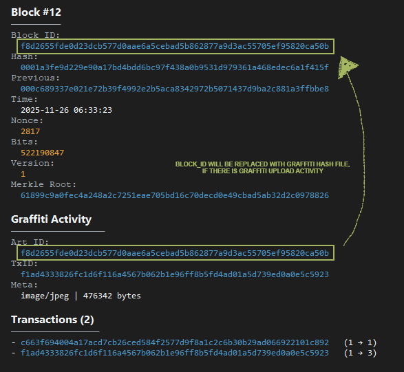
  </details>
  <details>
    <summary>Comment</summary>
    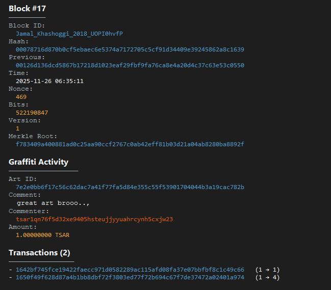
  </details>
> ⚠️ The graffiti data evidence above is still `under development`.
There is no `'Proof of Retention'` mechanism & epoch `pool storage payment` mechanism yet.

> ⚠️ even the `indexer` data in the storage node still has `'false'` payment status even though graffiti validation has been carried out on the chain
  

#### 3. 🌐 Example of a State Data Structure
State - is a database for overall network information. for user requests in the wallet section `Network Info Tab`
- ***State Data Structure (.json):***
  <details>
    <summary>See Preview</summary>

  ```json
  {
    "chain": {
      "avg_block_time_sec_window": 100.0,
      "est_network_hashrate_hps_window": 20,
      "genesis_hash": "00172ceef3126b7e1e941335b950ab68b7a8d070df602cab8cd331bfad49c9ad",
      "genesis_message": "Every person who is born free has the same rights and dignity. (Munir Said Thalib - 2004-09-07)",
      "max_bits": 530579455,
      "median_time_past": 1764113693,
      "target_block_time_sec": 37,
      "tip_bits": 522190847,
      "tip_chainwork": 45056,
      "tip_difficulty": 2048,
      "tip_hash": "0017f73ac7cf1a2dd29b927b9894f44608f4b8729b28fb9158825f9b0b529536",
      "tip_height": 21,
      "tip_target_hex": "0x1fffff00000000000000000000000000000000000000000000000000000000",
      "tip_timestamp": 1764113938,
      "total_block_size_bytes": 26432,
      "total_blocks": 22
    },
    "files": {
      "blockchain_json_sha256": "8170449c6ea6d08f707fee3c7aea3649d9fc33fc26761b8bd4502796f2f6560e"
    },
    "graffiti": {
      "comments": 1,
      "posts": 1
    },
    "identity": {
      "address_prefix": "tsar",
      "network_id": "gulag-net",
      "network_magic_hex": "54534152434841494e",
      "pow_algo": "randomx"
    },
    "last_updated": "2025-11-26T06:39:17.480144+07:00",
    "miners_snapshot": {
      "top_miners": [
        [
          "tsar1qyekatj93lvaq6xr3q9r8zwhkdzmk9hr0fmfrss",
          19
        ],
        [
          "tsar1qakf6mle606amn7xumvz4k6yu6cz0mxq6pe5qwr",
          3
        ]
      ]
    },
    "schema_version": 1,
    "supply": {
      "blocks_to_halving": 234978,
      "circulating_estimate": 250475000000000,
      "coinbase_maturity": 3,
      "current_block_subsidy": 25000000000,
      "current_epoch": 0,
      "emitted_subsidy": 250525000000000,
      "immature_coinbase": 50000000000,
      "max_supply": 25250000000000000,
      "next_halving_height": 235000,
      "utxo_total_value": 250525000000000
    },
    "total_blocks": 22,
    "total_supply": 250525000000000,
    "transactions": {
      "mempool_bytes_estimate": 0,
      "mempool_max_bytes": 1048576,
      "mempool_txs": 0,
      "mempool_vbytes_estimate": 0,
      "total_fees_paid": 16033,
      "total_non_coinbase_txs": 4,
      "total_txs": 26
    },
    "utxo": {
      "utxo_set_size": 26
    }
  }
  ```
  </details>
> ℹ️ All of the above data structure evidence uses the `.json` storage backend (debugging mode).
The default storage model in this project is `.mdb` LMDB.

---

## 🔐 Security Notes

- Chat privacy uses X3DH + Double Ratchet (simple implementation).
- This is experimental software; there haven't been many network security audits, a independet project with little experience in low-level engineering.
- If you run validators/miners publicly, just **mining it!** **fork it!** **learn it!** **Look for vulnerabilities!** and see how blockchain work.
- There's no **testnet** yet, no **mainnet** yet,
- There are no promises of **riches** here.
- There are still many **bugs to fix**. If you want to test publicly, use your own private VPS.

---

## 🫂 Contributing

Pull requests are welcome. Please start with small, well‑scoped changes (docs, tests, logging), then propose larger work via issues. Be respectful: the mission is **Voice Sovereignty**.
> I've provided a logging tool. For easier debugging, you can check [`src/tsarchain/utils/tsar_logging.py`](src/tsarchain/utils/tsar_logging.py)

- #### Development Support
  > If you want to accelerate development of TsarChain,
  infrastructure, testing, and documentation require fuel.
  <details>
    <summary>Supporting address</summary>

    ```json
    BTC : bc1qr2shk3fp80g7xjkg65q6cmvdgsdgmy953esfs6
    ```
  > Donations are voluntary, anonymous, and respected.
  No promises. No expectations. No manipulation.
  Funds go straight into development — not hype.
  </details>


---

## 🗺️ Roadmap

- Graffiti & Storage Node incentives
- Exploring & View Graffiti art in Kremlin Wallet
- Mobile app 'Graffiti'
- The Voice Sovereignty

---

## 📄 Documentation

##### Grungepaper
- [`Grungepaper - The Voice Sovereignty (EN)`](docs/Grungepaper%20-%20The%20Voice%20Sovereignty%20(EN).pdf) | [*Download*](docs/Grungepaper%20-%20The%20Voice%20Sovereignty%20(EN).pdf?raw=true)
- [`Grungepaper - The Voice Sovereignty (ID)`](docs/Grungepaper%20-%20The%20Voice%20Sovereignty%20(ID).pdf) | [*Download*](docs/Grungepaper%20-%20The%20Voice%20Sovereignty%20(ID).pdf?raw=true)

##### Graffiti Protocol
- [`Graffiti Protocol - Draft v0.1 (EN)`](docs/Graffiti%20Protocol%20-%20Draft%20v0.1%20(EN).pdf) | [*Download*](docs/Graffiti%20Protocol%20-%20Draft%20v0.1%20(EN).pdf?raw=true)
- [`Graffiti Protocol - Draft v0.1 (ID)`](docs/Graffiti%20Protocol%20-%20Draft%20v0.1%20(ID).pdf) | [*Download*](docs/Graffiti%20Protocol%20-%20Draft%20v0.1%20(ID).pdf?raw=true)

##### Rust
- [`README.md`](tsarcore_native/README.md) [`INSTALL_NATIVE.md`](INSTALL_NATIVE.md)

##### Trademarks & References
- [`TRADEMARKS.md`](TRADEMARKS.md) [`REFERENCES.md`](REFERENCES.md)

---

## 📜 License

[`MIT`](LICENSE)
