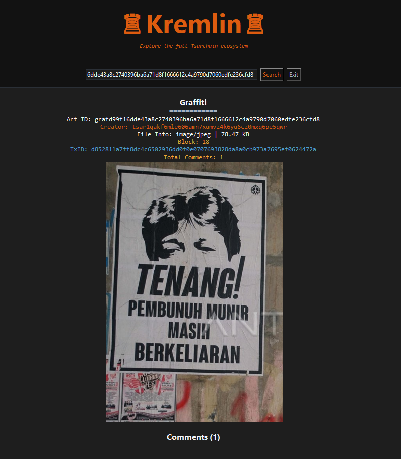
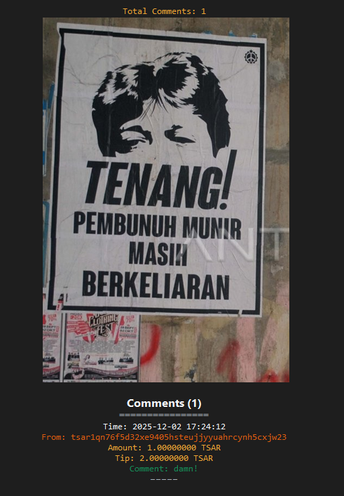

# Graffiti Protocol Architecture

<p align="center">
  
</p>


This document provides an in-depth technical overview of the Graffiti Protocol. The architecture relies on a hybrid design that couples lightweight on-chain UTXO execution with off-chain heavy data storage, prioritizing the permanent archiving of digital art and testimonies.


---


## 🏗️ Project & Data Structure's

- ***Project Folder Map***
  <details>
    <summary>See Preview</summary>

  ```markdown

    TsarChain/
    ├── apps/
    │   │
    │   ├── cli_archivist.py                     # Storage Node (Archivist CLI)
    │   ├── cli_node_miner.py                    # Miner CLI (Full Node)
    │   └── wallet.py                            # Wallet GUI (Kremlin Wallet) 
    │
    ├── assets/                                  # Logo, img, etc.
    ├── benchmarks/                              # tsarcore_native bechmarks test
    ├── docs/                                    # Documentation, Whitepaper & Draft Protocol
    ├── scripts/                                 # Development utility scripts
    ├── src/
    │   │
    │   ├── archivist/
    │   │   ├── cosmetic_archivist/
    │   │   │   ├── interface.py                 # colorama CLI module
    │   │   │   └── tui.py                       # TUI for CLI
    │   │   │
    │   │   ├── archivist_orchestrator.py        # Storage Node CLI/Main logic
    │   │   ├── connect.py                       # P2P network logic ( send & receive )
    │   │   ├── database_archivist.py            # database logic
    │   │   ├── node_route.py                    # node RPC route
    │   │   ├── server_archivist.py              # server start module
    │   │   ├── storage.guard.py                 # ratelimit guard archivist
    │   │   └── wallet_route.py                  # user RPC route
    │   │
    │   ├── kremlin/                            
    │   │   ├── security/
    │   │   │   ├── chat/
    │   │   │   │     ├── chat_common.py         # Helper & Common chat logic
    │   │   │   │     ├── double_ratchet.py      # Double Rachet Logic
    │   │   │   │     └── triple_xdh.py          # 3XDH Logic
    │   │   │   │
    │   │   │   └── data_security.py             # Wallet security management
    │   │   │
    │   │   ├── services/
    │   │   │   ├── contact_management.py        # Contacts Management
    │   │   │   ├── explorer_providers.py        # Explorer API Providers
    │   │   │   ├── graffiti_service.py          # Post, Upload & Comment graffiti service logic
    │   │   │   ├── media.py                     # VLC media player
    │   │   │   ├── rpc_kremlin.py               # RPC API logic
    │   │   │   ├── send_services.py             # send TX logic
    │   │   │   └── tx_history.py                # History Transactions cached Management
    │   │   │
    │   │   ├── tab_ui/
    │   │   │   ├── explore/
    │   │   │   │   ├── address_search.py        # Address result UI explore
    │   │   │   │   ├── block_search.py          # Block result UI explore
    │   │   │   │   ├── graffiti_search.py       # Graffiti result UI explore
    │   │   │   │   ├── main_tab.py              # Main Tab UI Explore
    │   │   │   │   └── txid_search.py           # Txid result UI explore
    │   │   │   │
    │   │   │   ├── app_sidebar.py               # Sidebar Tab Logic
    │   │   │   ├── chat_tab.py                  # Chat Tab UI Module
    │   │   │   ├── dev_tab.py                   # Dev Tab UI Module
    │   │   │   ├── graffiti_tab.py              # Graffiti Tab UI Module
    │   │   │   ├── history_tab.py               # History Tab UI Module
    │   │   │   ├── lockscreen.py                # Lockscreen Module
    │   │   │   ├── network_tab.py               # Network Info Tab UI Module
    │   │   │   ├── send_tab.py                  # Send Tx Tab UI Module
    │   │   │   └── wallet_tab.py                # Wallet Management Tab UI Module
    │   │   │
    │   │   ├── theme.py                         # Light & Dark Theme Module
    │   │   ├── ui_state.py                      # Busy Manager
    │   │   └── ui_utils.py                      # UI helpers
    │   │ 
    │   ├── tsarchain/
    │   │   ├── consensus/
    │   │   │   ├── blockchain.py                # Blockhain initialize module
    │   │   │   ├── chain_ops.py                 # swap tip, pruning mempool, and add block logic
    │   │   │   ├── chain_storage.py             # Backup & database chain management
    │   │   │   ├── difficulty.py                # Difficulty Consensus Logic
    │   │   │   ├── genesis.py                   # Create genesis & validate genesis logic
    │   │   │   ├── mining.py                    # Mining flow looping logic
    │   │   │   ├── rewards.py                   # Coinbase reward logic
    │   │   │   ├── utxo_validate.py             # UTXO sync and validate
    │   │   │   └── validation.py                # Consensus core validation block & Transactions
    │   │   │
    │   │   ├── contracts/          
    │   │   │   ├── graffiti_registry.py         # Graffiti metadata database
    │   │   │   └── graffiti.py                  # Graffiti core logic
    │   │   │
    │   │   ├── core/               
    │   │   │   ├── block.py                     # Block data structure init
    │   │   │   ├── coinbase.py                  # coinbase logic
    │   │   │   └── tx.py                        # Transaction Logic
    │   │   │
    │   │   ├── mempool/
    │   │   │   ├── orphan.py                    # Orphan check
    │   │   │   ├── policy.py                    # Mempool policy logic
    │   │   │   ├── pool.py                      # Mempool initialize
    │   │   │   ├── scripts.py                   # Script & serialize
    │   │   │   ├── storage.py                   # Mempool Storage Logic
    │   │   │   ├── types.py                     # Normalize prevout set
    │   │   │   └── validation.py                # Mempool core valodation logic
    │   │   │
    │   │   ├── miner/
    │   │   │   ├── cosmetic
    │   │   │   │   ├── interface.py             # colorama CLI module
    │   │   │   │   └── tui.py                   # TUI for CLI
    │   │   │   │
    │   │   │   └── orchestrator.py              # miner/node CLI logic
    │   │   │
    │   │   ├── network/
    │   │   │   ├── cast/
    │   │   │   │   ├── base.py                  # Proxy Handler
    │   │   │   │   ├── chain_utils.py           # validate incoming chain logic
    │   │   │   │   ├── gossip.py                # gossip block
    │   │   │   │   ├── mempool_sync.py          # mempool sync p2p
    │   │   │   │   ├── receive.py               # receive p2p data logic
    │   │   │   │   └── utxo_local.py            # rebuild local UTXO
    │   │   │   │
    │   │   │   ├── node_logic/
    │   │   │   │   ├── chat_state.py            # chat initialize
    │   │   │   │   ├── discovery.py             # discovery peers logic
    │   │   │   │   ├── handlers.py              # handle p2p data logic
    │   │   │   │   ├── peers.py                 # reward and penalty peers
    │   │   │   │   ├── ratelimit.py             # rate limiting logic
    │   │   │   │   ├── rpc_client.py            # peer caching & request management
    │   │   │   │   ├── server_node.py           # starting server logic
    │   │   │   │   ├── storage_registry.py      # registry storage node
    │   │   │   │   └── sync.py                  # sync logic
    │   │   │   │
    │   │   │   ├── rpc/
    │   │   │   │   ├── user_rpc/
    │   │   │   │   |   ├── category/
    |   │   │   │   │   |   ├── chat.py                # All Chat RPC on Wallet
    |   │   │   │   │   |   ├── explorer.py            # Exploring Tsarchain RPC (Block Detail, Tx Details, etc)
    |   │   │   │   │   |   ├── graff_activities.py    # All Graffiti RPC
    |   │   │   │   │   |   ├── networking.py          # Ping, Get peers & Stor List
    |   │   │   │   │   |   └── transactions.py        # All Transactions RPC
    |   │   │   │   │   |
    │   │   │   │   |   ├── common.py                  # common helper
    │   │   │   │   |   └── dispatcher.py              # Handler Map RPC
    │   │   │   │   |
    │   │   │   │   ├── miner_rpc.py                   # miner RPC api gateway
    │   │   │   │   ├── processing_msg.py              # role base & security RPC api
    │   │   │   │   └── storage_rpc.py                 # storage RPC api gateway
    │   │   │   │
    │   │   │   ├── rpc_helper/
    |   │   │   │   ├── base.py                        # Proxy Handler
    |   │   │   │   ├── chat.py                        # Helper for chat rpc
    |   │   │   │   ├── explorer.py                    # Explorer helper 'block,tx details, etc'
    |   │   │   │   ├── guard.py                       # Guar tb_allow rpc
    |   │   │   │   ├── history.py                     # History tx helper rpc
    |   │   │   │   └── tx.py                          # All Transaction model helper (regular, post, comment, payouts)
    |   │   │   │
    │   │   │   ├── broadcast.py                       # Broadcast initialize
    │   │   │   ├── dandelion_pp.py                    # minimal dandelion ++ modul
    │   │   │   ├── node.py                            # Node initialize
    │   │   │   ├── peers_storage.py                   # keys management storage
    │   │   │   ├── pow_token.py                       # POW toke module
    │   │   │   └── protocol.py                        # handshake & p2p transport protocol
    │   │   │
    │   │   ├── storage/
    │   │   │   ├── utxo_logic/
    │   │   │   │   ├── balances.py                    # Balance lookup logic
    │   │   │   │   ├── database.py                    # UTXO database logic
    │   │   │   │   ├── graff_utxo.py                  # graffiti UTXO logic
    │   │   │   │   └── validate.py                    # core validation UTXO logic
    │   │   │   │
    │   │   │   ├── kv.py                              # LMDB database logic
    │   │   │   └── utxo.py                            # UTXO initialize
    │   │   │
    │   │   └── utils/
    │   │       ├── benchmarks.py                      # Benchmark decorator for method functions
    │   │       ├── bootstrap.py                       # auto backup / snapshot logic
    │   │       ├── config.py                          # ALL project Configuration
    │   │       ├── helpers.py                         # script helpers
    │   │       ├── thread_check.py                    # thread monitoring
    │   │       └── tsar_logging.py                    # logging module
    │   │
    │   └── web/
    │       ├── Backend/            # ALL Backend Website Module
    │       └── Frontend/            # ALL Frontend Website Module
    │
    ├── tools/                      # LMDB database tools & Snapshot maintenance
    │
    ├── tsarcore_native/
    │        ├── src/               # ALL Native Module (Rust + PyO3)
    │        └── tests/             # Unit Test For Rust
    │
    └── tests/                      # All Python Unit testing

  ```
  </details>

#### 1. 💸 Example of a Transaction Data Structure
The example data of `block, utxo's & mempool` below, shows a transaction :
> address `tsar1qakf6mle606amn7xumvz4k6yu6cz0mxq6pe5qwr` sent 2300 coins + 0,00004900 fee to address`tsar1qn76f5d32xe9405hsteujjyyuahrcynh5cxjw23`,
then validated by miner `tsar1qyekatj93lvaq6xr3q9r8zwhkdzmk9hr0fmfrss` in block height 10
- ***Block Data Structure (.json):***
  <details>
    <summary>See Preview</summary>

  ```json
    {
      "_meta": {
        "bits": 520891868,
        "chainwork": 42774,
        "comment_count": 0,
        "comments": [],
        "difficulty": 5381,
        "graffiti": [],
        "graffiti_post_count": 0,
        "hash": "0002ad9c5a26748032625d4a95d1df44e9bd4f7d69064c0dcc7e52673706c128",
        "height": 10,
        "merkle_root": "9042794daf2d482b486f912cbb043f22c1505c7d1f7fd07cceea8a55b9b2feaa",
        "nonce": 4030,
        "payout_count": 0,
        "payouts": [],
        "prev_block_hash": "0008509a86bf895c69201986b7fad8ac3013dec48020aab8975f835d812dcd38",
        "schema_version": 1,
        "size_bytes": 1695,
        "target": 2.151867455121296e73,
        "timestamp": 1764669449,
        "tx_count": 2,
        "vbytes": 1695,
        "version": 1,
        "weight": 6780
      },
      "bits": 520891868,
      "hash": "0002ad9c5a26748032625d4a95d1df44e9bd4f7d69064c0dcc7e52673706c128",
      "height": 10,
      "merkle_root": "9042794daf2d482b486f912cbb043f22c1505c7d1f7fd07cceea8a55b9b2feaa",
      "nonce": 4030,
      "prev_block_hash": "0008509a86bf895c69201986b7fad8ac3013dec48020aab8975f835d812dcd38",
      "timestamp": 1764669449,
      "transactions": [
        {
          "block_id": "Evan_Gershkovich_2023_fv8Zsb0I4",
          "fee": 0,
          "height": 10,
          "inputs": [
            {
              "amount": 0,
              "script_sig": "010a1f4576616e5f47657273686b6f766963685f323032335f6676385a7362304934",
              "txid": "0000000000000000000000000000000000000000000000000000000000000000",
              "vout": 4294967295,
              "witness": []
            }
          ],
          "is_coinbase": true,
          "locktime": 0,
          "outputs": [
            {
              "amount": 25000004900,
              "script_pubkey": "0014266dd5c8b1fb3a0d18710146713af668b762dc6f"
            }
          ],
          "reward": 25000004900,
          "to_address": "tsar1qyekatj93lvaq6xr3q9r8zwhkdzmk9hr0fmfrss", // miner
          "txid": "4a5aa34596685b8eeff5f40ce6cf53fece1cd57e6a8cce9c984c7334ea36d2b4",
          "type": "Coinbase",
          "version": 1
        },
        {
          "fee": 4900,
          "inputs": [
            {
              "amount": 2500000000000,
              "script_sig": "",
              "txid": "9555fe396baf338bb3b8c27fa30b414ce1eeecd830a416895ab12eecf5188e45",
              "vout": 0,
              "witness": [
                "3045022100d51d37097042d95a552218df5130347e9b090630447b9e00d88a7eb52af4599b0220501544279d82de6d795588b538e5e3461cd962c25339ba723a7541f942a68a5d01",
                "0338e4581fec6cee44675bae99ff4eabe31d1ef412e54bb16f96ee97d796515e58"
              ]
            }
          ],
          "is_coinbase": false,
          "locktime": 0,
          "outputs": [
            {
              "amount": 230000000000,
              "script_pubkey": "00149fb49a362a364b57d2f05e7929109cedc7824ef4"  // recipient
            },
            {
              "amount": 2269999995100,
              "script_pubkey": "0014ed93adff3a7ebbb9f8dcdb055b689cd604fd981a"  // sender
            }
          ],
          "txid": "88bc192050945f1723ab416d8c53bc1b332d2d8fa737d3dfb26c931df9fc04b5",
          "version": 1
        }
      ],
      "version": 1
    }
  ```
  </details>

- ***UTXO's Data Structure (.json):***
  <details>
    <summary>See Preview</summary>

  ```json
    "4a5aa34596685b8eeff5f40ce6cf53fece1cd57e6a8cce9c984c7334ea36d2b4:0": {
      "address": "tsar1qyekatj93lvaq6xr3q9r8zwhkdzmk9hr0fmfrss", // miner
      "block_height": 10,
      "is_coinbase": true,
      "script_type": "p2wpkh",
      "tx_out": {
        "amount": 25000004900,
        "script_pubkey": "0014266dd5c8b1fb3a0d18710146713af668b762dc6f"
      }
    },
    "88bc192050945f1723ab416d8c53bc1b332d2d8fa737d3dfb26c931df9fc04b5:0": {
      "address": "tsar1qn76f5d32xe9405hsteujjyyuahrcynh5cxjw23", // recipient
      "block_height": 10,
      "is_coinbase": false,
      "script_type": "p2wpkh",
      "tx_out": {
        "amount": 230000000000,
        "script_pubkey": "00149fb49a362a364b57d2f05e7929109cedc7824ef4"
      }
    },
    "88bc192050945f1723ab416d8c53bc1b332d2d8fa737d3dfb26c931df9fc04b5:1": {
      "address": "tsar1qakf6mle606amn7xumvz4k6yu6cz0mxq6pe5qwr", // sender
      "block_height": 10,
      "is_coinbase": false,
      "script_type": "p2wpkh",
      "tx_out": {
        "amount": 2269999995100,
        "script_pubkey": "0014ed93adff3a7ebbb9f8dcdb055b689cd604fd981a"
      }
    }
  ```
  </details>

- ***MemPool Data Structure (.json):***
  <details>
    <summary>See Preview</summary>

  ```json
  {
    "meta": {
      "count": 1,
      "generated_at": 1764669428,
      "max_size_bytes": 1048576,
      "schema_version": 1,
      "virtual_size": 205
    },
    "schema_version": 1,
    "txs": [
      {
        "_meta": {
          "fee_rate": 23.902439024390244,
          "received_at": 1764669428.5156598,
          "schema_version": 1,
          "vbytes": 205,
          "weight": 820
        },
        "fee": 4900,
        "inputs": [
          {
            "amount": 2500000000000,
            "script_sig": "",
            "txid": "9555fe396baf338bb3b8c27fa30b414ce1eeecd830a416895ab12eecf5188e45",
            "vout": 0,
            "witness": [
              "3045022100d51d37097042d95a552218df5130347e9b090630447b9e00d88a7eb52af4599b0220501544279d82de6d795588b538e5e3461cd962c25339ba723a7541f942a68a5d01",
              "0338e4581fec6cee44675bae99ff4eabe31d1ef412e54bb16f96ee97d796515e58"
            ]
          }
        ],
        "is_coinbase": false,
        "locktime": 0,
        "outputs": [
          {
            "amount": 230000000000,
            "script_pubkey": "00149fb49a362a364b57d2f05e7929109cedc7824ef4" // recipient
          },
          {
            "amount": 2269999995100,
            "script_pubkey": "0014ed93adff3a7ebbb9f8dcdb055b689cd604fd981a" // sender
          }
        ],
        "txid": "88bc192050945f1723ab416d8c53bc1b332d2d8fa737d3dfb26c931df9fc04b5",
        "version": 1
      }
    ]
  }
  ```
  </details>

#### 2. 🎨 Example of a Graffiti Activity Data Structure
The example data of `block (height 18), block (height 22), block (29), metadata & indexer` below, shows a graffiti activity :
> creator `tsar1qakf6mle606amn7xumvz4k6yu6cz0mxq6pe5qwr` upload the graffiti art 80358 bytes (80 kb) and pay 0.8 coins to the network and validated in `block height 18`

>then someone `tsar1qn76f5d32xe9405hsteujjyyuahrcynh5cxjw23` commented on the graffiti art with 1 coin (standard billable comment in network) and gave a tip (optional) of 2 coins for creator validated in `block height 22`

> archivist `tsar1qzxzzf5az5guk43mf0z4d94uugat4jcejwglp07` (storage node) make payouts of 0.6 coin, to pool address `tsar1qm0vgpssx8w95ddktmfg86ahhy863nu2u42w5qceh3n24xkvk83mqqa2jng` validated in `block height 29`
- ***Block (graffiti) Data Structure (.json):***
  <details>
    <summary>See Preview</summary>

  ```json
    {
      "_meta": {
        "bits": 521525829,
        "chainwork": 73967,
        "comment_count": 0,
        "comments": [],
        "difficulty": 2999,
        "graffiti": [
          {
            "art_id": "grafd99f16dde43a8c2740396ba6a71d8f1666612c4a9790d7060edfe236cfd8", // art_id
            "block_hash": "0000c537b986eb97881f942e6f5e716cbe544029fd3ea697eb85c99ee9f636f8",
            "creator": "tsar1qakf6mle606amn7xumvz4k6yu6cz0mxq6pe5qwr", // creator
            "mime": "image/jpeg",
            "receipt": "rcpt_9b29cf795af60e77ee707df235f276e825fc0ee0f0c75b8b76d0dd29f7cdf701_1764670929_1764670929",
            "sha256": "9b29cf795af60e77ee707df235f276e825fc0ee0f0c75b8b76d0dd29f7cdf701", // hash file (.jpg)
            "size": 80358,
            "storer": "tsar1qzxzzf5az5guk43mf0z4d94uugat4jcejwglp07", // archivist (storage_node)
            "txid": "d852811a7ff8dc4c6502936dd0f0e0707693828da8a0cb973a7695ef0624472a"
          }
        ],
        "graffiti_post_count": 1,
        "hash": "0000c537b986eb97881f942e6f5e716cbe544029fd3ea697eb85c99ee9f636f8",
        "height": 18,
        "merkle_root": "35331b2172cff6289e0f3f85db0d441f8e760531fe92f493b7c08ef9b9c3a06c",
        "nonce": 2816,
        "payout_count": 0,
        "payouts": [],
        "prev_block_hash": "00012e0e71f14de12c889b94c5459cead2a93fca5ba1a281a4dd1053a844b6a4",
        "schema_version": 1,
        "size_bytes": 2747,
        "target": 3.861022930026645e73,
        "timestamp": 1764670983,
        "tx_count": 2,
        "vbytes": 2747,
        "version": 1,
        "weight": 10988
      },
      "bits": 521525829,
      "hash": "0000c537b986eb97881f942e6f5e716cbe544029fd3ea697eb85c99ee9f636f8",
      "height": 18,
      "merkle_root": "35331b2172cff6289e0f3f85db0d441f8e760531fe92f493b7c08ef9b9c3a06c",
      "nonce": 2816,
      "prev_block_hash": "00012e0e71f14de12c889b94c5459cead2a93fca5ba1a281a4dd1053a844b6a4",
      "timestamp": 1764670983,
      "transactions": [
        {
          "block_id": "grafd99f16dde43a8c2740396ba6a71d8f1666612c4a9790d7060edfe236cfd8", // art_id (anchoring)
          "fee": 0,
          "height": 18,
          "inputs": [
            {
              "amount": 0,
              "script_sig": "01124067726166643939663136646465343361386332373430333936626136613731643866313636363631326334613937393064373036306564666532333663666438",
              "txid": "0000000000000000000000000000000000000000000000000000000000000000",
              "vout": 4294967295,
              "witness": []
            }
          ],
          "is_coinbase": true,
          "locktime": 0,
          "outputs": [
            {
              "amount": 25000000171,
              "script_pubkey": "0014266dd5c8b1fb3a0d18710146713af668b762dc6f"
            }
          ],
          "reward": 25000000171,
          "to_address": "tsar1qyekatj93lvaq6xr3q9r8zwhkdzmk9hr0fmfrss", // miner
          "txid": "04fcd1e79630b9fa6c72fa6dea902eba662a6f8dd0ecb63fb9e0f308117d85ae",
          "type": "Coinbase",
          "version": 1
        },
        {
          "fee": 171,
          "inputs": [
            {
              "amount": 2269999995100,
              "script_sig": "",
              "txid": "88bc192050945f1723ab416d8c53bc1b332d2d8fa737d3dfb26c931df9fc04b5",
              "vout": 1,
              "witness": [
                "3045022100886859c0595f78167d8e914be72ca17a4ae6e51c3c61fe8ab3370f1148364aa802200860248bd8f8e7aa94d761acb76571cc3503d188080aa965c9bcc532af321e6c01",
                "0338e4581fec6cee44675bae99ff4eabe31d1ef412e54bb16f96ee97d796515e58"
              ]
            }
          ],
          "is_coinbase": false,
          "locktime": 0,
          "outputs": [
            {
              "amount": 80000000,
              "script_pubkey": "0020dbd880c2063b8b46b6cbda507d76f721f519f15caa9d4063378cd55359963c76" // pool
            },
            {
              "amount": 2269919994929,
              "script_pubkey": "0014ed93adff3a7ebbb9f8dcdb055b689cd604fd981a" // creator
            },
            {
              "amount": 0,
              "script_pubkey": "6a4dbd01545341525f47524146317c7b22736861323536223a2239623239636637393561663630653737656537303764663233356632373665383235666330656530663063373562386237366430646432396637636466373031222c226172745f6964223a2267726166643939663136646465343361386332373430333936626136613731643866313636363631326334613937393064373036306564666532333663666438222c2273697a65223a38303335382c226d696d65223a22696d6167652f6a706567222c2273746f726572223a227473617231717a787a7a6635617a3567756b34336d66307a346439347575676174346a63656a77676c703037222c2272656365697074223a22726370745f396232396366373935616636306537376565373037646632333566323736653832356663306565306630633735623862373664306464323966376364663730315f313736343637303932395f31373634363730393239222c226576656e74223a22504f5354222c2263726561746f72223a22747361723171616b66366d6c65363036616d6e3778756d767a346b36797536637a306d787136706535717772222c227473223a313736343637303932397d"
            }
          ],
          "txid": "d852811a7ff8dc4c6502936dd0f0e0707693828da8a0cb973a7695ef0624472a",
          "version": 1
        }
      ],
      "version": 1
    },
  ```
  </details>

- ***Block (comment) Data Structure (.json):***
  <details>
    <summary>See Preview</summary>

  ```json
    {
      "_meta": {
        "bits": 521422584,
        "chainwork": 86006,
        "comment_count": 1,
        "comments": [
          {
            "amount": 100000000,
            "art_id": "grafd99f16dde43a8c2740396ba6a71d8f1666612c4a9790d7060edfe236cfd8", // art id
            "comment_len": 5,
            "commenter": "tsar1qn76f5d32xe9405hsteujjyyuahrcynh5cxjw23", // commenter
            "creator": "tsar1qakf6mle606amn7xumvz4k6yu6cz0mxq6pe5qwr", // creator
            "tip": 200000000,
            "txid": "a0ad4ea081325a40e61926b3657533750ed704ace00dadc0b087ea8d5fb20576"
          }
        ],
        "difficulty": 3232,
        "graffiti": [],
        "graffiti_post_count": 0,
        "hash": "000e99f426c6a97a5e9cd21def839b67b7d4321e9b99b62fdeec08fbb01cc59b",
        "height": 22,
        "merkle_root": "6d643a32a10e392b12a6d96362e7ce018cc55e6339f2754e561324bd42b995fc",
        "nonce": 12779,
        "payout_count": 0,
        "payouts": [],
        "prev_block_hash": "0013520d85a20b56918c0b39257b40c016d75d98d0a71508589e7278cdb4b7f3",
        "schema_version": 1,
        "size_bytes": 2431,
        "target": 3.582674960661648e73,
        "timestamp": 1764671129,
        "tx_count": 2,
        "vbytes": 2431,
        "version": 1,
        "weight": 9724
      },
      "bits": 521422584,
      "hash": "000e99f426c6a97a5e9cd21def839b67b7d4321e9b99b62fdeec08fbb01cc59b",
      "height": 22,
      "merkle_root": "6d643a32a10e392b12a6d96362e7ce018cc55e6339f2754e561324bd42b995fc",
      "nonce": 12779,
      "prev_block_hash": "0013520d85a20b56918c0b39257b40c016d75d98d0a71508589e7278cdb4b7f3",
      "timestamp": 1764671129,
      "transactions": [
        {
          "block_id": "Pavel_Sheremet_2016_gC33ZOrDr",
          "fee": 0,
          "height": 22,
          "inputs": [
            {
              "amount": 0,
              "script_sig": "01161d506176656c5f53686572656d65745f323031365f674333335a4f724472",
              "txid": "0000000000000000000000000000000000000000000000000000000000000000",
              "vout": 4294967295,
              "witness": []
            }
          ],
          "is_coinbase": true,
          "locktime": 0,
          "outputs": [
            {
              "amount": 25000000202,
              "script_pubkey": "0014266dd5c8b1fb3a0d18710146713af668b762dc6f"
            }
          ],
          "reward": 25000000202,
          "to_address": "tsar1qyekatj93lvaq6xr3q9r8zwhkdzmk9hr0fmfrss",
          "txid": "f5b26376d8947c2744dbaea9bafcda36845e474046a4a3371a7a36bdfc171e7d",
          "type": "Coinbase",
          "version": 1
        },
        {
          "fee": 202,
          "inputs": [
            {
              "amount": 230000000000,
              "script_sig": "",
              "txid": "88bc192050945f1723ab416d8c53bc1b332d2d8fa737d3dfb26c931df9fc04b5",
              "vout": 0,
              "witness": [
                "3045022100aef1008b30c5ea7baf0fa75934c2e6a5d8b27d4ab6d0bd8c1832d3ed5ed5489202206fd8436385a4830c6461b0a838d32c57bd209c1030a803c5f605fb9279af382c01",
                "020f4c2347cb74eee085bae4d7579305ca58beeb1a2797493e371efb78e7e7d558"
              ]
            }
          ],
          "is_coinbase": false,
          "locktime": 0,
          "outputs": [
            {
              "amount": 280000000,
              "script_pubkey": "0014ed93adff3a7ebbb9f8dcdb055b689cd604fd981a" // creator
            },
            {
              "amount": 10000000,
              "script_pubkey": "0020dbd880c2063b8b46b6cbda507d76f721f519f15caa9d4063378cd55359963c76" // pool
            },
            {
              "amount": 229709999798,
              "script_pubkey": "00149fb49a362a364b57d2f05e7929109cedc7824ef4" // commenter
            },
            {
              "amount": 0,
              "script_pubkey": "6a4d2801545341525f47524146317c7b226576656e74223a22434f4d4d454e54222c226172745f6964223a2267726166643939663136646465343361386332373430333936626136613731643866313636363631326334613937393064373036306564666532333663666438222c22636f6d6d656e74223a2236343631366436653231222c22616d6f756e74223a3130303030303030302c22746970223a3230303030303030302c2263726561746f72223a22747361723171616b66366d6c65363036616d6e3778756d767a346b36797536637a306d787136706535717772222c22636f6d6d656e746572223a227473617231716e3736663564333278653934303568737465756a6a79797561687263796e683563786a773233222c227473223a313736343637313035327d"
            }
          ],
          "txid": "a0ad4ea081325a40e61926b3657533750ed704ace00dadc0b087ea8d5fb20576",
          "version": 1
        }
      ],
      "version": 1
    },
  ```
  </details>

- ***Block (payouts) Data Structure (.json):***
  <details>
    <summary>See Preview</summary>

  ```json
    {
      "_meta": {
        "bits": 521872887,
        "chainwork": 104971,
        "comment_count": 0,
        "comments": [],
        "difficulty": 2414,
        "graffiti": [],
        "graffiti_post_count": 0,
        "hash": "0002b13e5a9b9b19098eb1d7fd9aa2ab7e5a9869bb20d038ef823a54790fc5d0",
        "height": 29,
        "merkle_root": "6d29e9debd645f783d81342f5c8d5ab3906284ede9b6244476c9c737fd907896",
        "nonce": 5935,
        "payout_count": 1,
        "payouts": [
          {
            "art_id": "grafd99f16dde43a8c2740396ba6a71d8f1666612c4a9790d7060edfe236cfd8",
            "epoch": 0,
            "recipients": [
              {
                "addr": "tsar1qzxzzf5az5guk43mf0z4d94uugat4jcejwglp07",
                "amount": 60000000
              }
            ],
            "txid": "cf5a20bfc3ac20250b1556cad466c4d1a6e937a6e7c8f645a6ff961e78dfe46d"
          }
        ],
        "prev_block_hash": "000a4682f35b9c4465f0d584c85d8bbbe6bdb319b0c5ab5b9cdf464f3644b2b2",
        "schema_version": 1,
        "size_bytes": 2066,
        "target": 4.7966894470674414e73,
        "timestamp": 1764672702,
        "tx_count": 2,
        "vbytes": 2066,
        "version": 1,
        "weight": 8264
      },
      "bits": 521872887,
      "hash": "0002b13e5a9b9b19098eb1d7fd9aa2ab7e5a9869bb20d038ef823a54790fc5d0",
      "height": 29,
      "merkle_root": "6d29e9debd645f783d81342f5c8d5ab3906284ede9b6244476c9c737fd907896",
      "nonce": 5935,
      "prev_block_hash": "000a4682f35b9c4465f0d584c85d8bbbe6bdb319b0c5ab5b9cdf464f3644b2b2",
      "timestamp": 1764672702,
      "transactions": [
        {
          "block_id": "Chelsea_Manning_2010_3M9K1XpeJ",
          "fee": 0,
          "height": 29,
          "inputs": [
            {
              "amount": 0,
              "script_sig": "011d1e4368656c7365615f4d616e6e696e675f323031305f334d394b315870654a",
              "txid": "0000000000000000000000000000000000000000000000000000000000000000",
              "vout": 4294967295,
              "witness": []
            }
          ],
          "is_coinbase": true,
          "locktime": 0,
          "outputs": [
            {
              "amount": 25000007000,
              "script_pubkey": "0014266dd5c8b1fb3a0d18710146713af668b762dc6f"
            }
          ],
          "reward": 25000007000,
          "to_address": "tsar1qyekatj93lvaq6xr3q9r8zwhkdzmk9hr0fmfrss",
          "txid": "b5b7cf44c7377ce91b324b5b1b1d6e9baad5716c4b5905607b2a8b6175ee4b33",
          "type": "Coinbase",
          "version": 1
        },
        {
          "fee": 7000,
          "inputs": [
            {
              "amount": 80000000,
              "script_sig": "",
              "txid": "d852811a7ff8dc4c6502936dd0f0e0707693828da8a0cb973a7695ef0624472a",
              "vout": 0,
              "witness": [
                "d99f16dde43a8c2740396ba6a71d8f1666612c4a9790d7060edfe236cfd8",
                "1ed99f16dde43a8c2740396ba6a71d8f1666612c4a9790d7060edfe236cfd887"
              ]
            }
          ],
          "is_coinbase": false,
          "locktime": 0,
          "outputs": [
            {
              "amount": 19993000,
              "script_pubkey": "0020dbd880c2063b8b46b6cbda507d76f721f519f15caa9d4063378cd55359963c76"
            },
            {
              "amount": 60000000,
              "script_pubkey": "0014118424d3a2a2396ac76978aad2d79c4757596332"
            },
            {
              "amount": 0,
              "script_pubkey": "6a4ccc545341525f47524146317c7b226576656e74223a225041594f5554222c226172745f6964223a2267726166643939663136646465343361386332373430333936626136613731643866313636363631326334613937393064373036306564666532333663666438222c2265706f6368223a302c22726563697069656e7473223a5b7b2261646472223a227473617231717a787a7a6635617a3567756b34336d66307a346439347575676174346a63656a77676c703037222c22616d6f756e74223a36303030303030307d5d7d"
            }
          ],
          "txid": "cf5a20bfc3ac20250b1556cad466c4d1a6e937a6e7c8f645a6ff961e78dfe46d",
          "version": 1
        }
      ],
      "version": 1
    },
  ```
  </details>

- ***Graffiti (metadata) Structure (.json):***
  <details>
    <summary>See Preview</summary>

  ```json
  {
    "comments": {
      "grafd99f16dde43a8c2740396ba6a71d8f1666612c4a9790d7060edfe236cfd8": [
        {
          "amount": 100000000,
          "block_height": 22,
          "comment": "64616d6e21", // in hexadecimal (damn!)
          "commenter": "tsar1qn76f5d32xe9405hsteujjyyuahrcynh5cxjw23", // commenter
          "creator_paid": 280000000,
          "storage_paid": 10000000,
          "tip": 200000000,
          "ts": 1764671052,
          "txid": "a0ad4ea081325a40e61926b3657533750ed704ace00dadc0b087ea8d5fb20576"
        }
      ]
    },
    "payouts": {
      "grafd99f16dde43a8c2740396ba6a71d8f1666612c4a9790d7060edfe236cfd8": [
        {
          "amount": 60000000,
          "block_height": 29,
          "epoch": 0,
          "recipients": {
            "tsar1qzxzzf5az5guk43mf0z4d94uugat4jcejwglp07": 60000000 // archivist (storage_node)
          },
          "txid": "cf5a20bfc3ac20250b1556cad466c4d1a6e937a6e7c8f645a6ff961e78dfe46d"
        }
      ]
    },
    "posts": {
      "grafd99f16dde43a8c2740396ba6a71d8f1666612c4a9790d7060edfe236cfd8": {
        "amount_paid": 80000000,
        "art_id": "grafd99f16dde43a8c2740396ba6a71d8f1666612c4a9790d7060edfe236cfd8",
        "block_hash": "0000c537b986eb97881f942e6f5e716cbe544029fd3ea697eb85c99ee9f636f8",
        "block_height": 18,
        "creator": "tsar1qakf6mle606amn7xumvz4k6yu6cz0mxq6pe5qwr", // creator
        "mime": "image/jpeg",
        "pool_address": "tsar1qm0vgpssx8w95ddktmfg86ahhy863nu2u42w5qceh3n24xkvk83mqqa2jng", // pool
        "receipt": "rcpt_9b29cf795af60e77ee707df235f276e825fc0ee0f0c75b8b76d0dd29f7cdf701_1764670929_1764670929",
        "sha256": "9b29cf795af60e77ee707df235f276e825fc0ee0f0c75b8b76d0dd29f7cdf701", // hash file (.jpg)
        "size": 80358,
        "stats": {
          "comments": 1,
          "creator_paid": 280000000,
          "last_paid_epoch": 0,
          "pool_balance": 29993000,
          "storage_paid": 10000000
        },
        "storer": "tsar1qzxzzf5az5guk43mf0z4d94uugat4jcejwglp07",
        "txid": "d852811a7ff8dc4c6502936dd0f0e0707693828da8a0cb973a7695ef0624472a"
      }
    },
    "proofs": { // Proof of Retention
      "grafd99f16dde43a8c2740396ba6a71d8f1666612c4a9790d7060edfe236cfd8": [
        {
          "epoch": 1,
          "hash": "4da974820fa3deac4f0925e845835f32623176054676a3cc28d318b45ee6d8ca",
          "height": 20,
          "length": 4096,
          "offset": 38125,
          "seed": "f85e9f9f688c31a10420b4e53dff4b32897ee7d1b57f65cc65d22c7e866ede05",
          "storer": "tsar1qzxzzf5az5guk43mf0z4d94uugat4jcejwglp07",
          "ts": 1764671085
        },
        {
          "epoch": 2,
          "hash": "561aa6cabaeb6aebf7a40b469707a91ac5ca4a549efc96ffeb7bf3b654f3f164",
          "height": 30,
          "length": 4096,
          "offset": 39894,
          "seed": "24b28bae39021760f0a06df9701dfb49888dcd50d698f1d12c7fc145187af0fe",
          "storer": "tsar1qzxzzf5az5guk43mf0z4d94uugat4jcejwglp07",
          "ts": 1764672806
        }
      ]
    }
  }
  ```
  </details>

- ***Graffiti (indexer) in Storage Node (.json):***
  <details>
    <summary>See Preview</summary>

  ```json
  {
    "files": {
      "9b29cf795af60e77ee707df235f276e825fc0ee0f0c75b8b76d0dd29f7cdf701_1764670929": {
        "size_bytes": 80358,
        "sha256": "9b29cf795af60e77ee707df235f276e825fc0ee0f0c75b8b76d0dd29f7cdf701",
        "filename": "graff_test.jpg",
        "paid": true,
        "expire_at_height": 0,
        "confirmed_at_height": 18,
        "state": "stored",
        "path": "data/storage\\final\\9b29cf795af60e77ee707df235f276e825fc0ee0f0c75b8b76d0dd29f7cdf701_1764670929.bin",
        "received_bytes": 80358,
        "chunk_size": 102400,
        "created_ts": 1764670929,
        "art_id": "grafd99f16dde43a8c2740396ba6a71d8f1666612c4a9790d7060edfe236cfd8",
        "updated_ts": 1764670929,
        "receipt_id": "rcpt_9b29cf795af60e77ee707df235f276e825fc0ee0f0c75b8b76d0dd29f7cdf701_1764670929_1764670929",
        "receipt": {
          "id": "rcpt_9b29cf795af60e77ee707df235f276e825fc0ee0f0c75b8b76d0dd29f7cdf701_1764670929_1764670929",
          "graffiti_id": "9b29cf795af60e77ee707df235f276e825fc0ee0f0c75b8b76d0dd29f7cdf701_1764670929",
          "sha256": "9b29cf795af60e77ee707df235f276e825fc0ee0f0c75b8b76d0dd29f7cdf701",
          "size_bytes": 80358,
          "filename": "graff_test.jpg",
          "ts": 1764670929
        },
        "stored_ts": 1764670929,
        "txid_paid": "d852811a7ff8dc4c6502936dd0f0e0707693828da8a0cb973a7695ef0624472a",
        "last_proof_epoch": 2,
        "last_proof_ts": 1764672806,
        "last_proof_offset": 39894,
        "last_proof_length": 4096,
        "last_proof_hash": "561aa6cabaeb6aebf7a40b469707a91ac5ca4a549efc96ffeb7bf3b654f3f164",
        "last_proof_height": 30,
        "missed_proofs": 0,
        "proof_fail_reason": "",
        "proof_status": "ok"
      }
    },
    "bytes_used": 80358,
    "art_map": {
      "grafd99f16dde43a8c2740396ba6a71d8f1666612c4a9790d7060edfe236cfd8": "9b29cf795af60e77ee707df235f276e825fc0ee0f0c75b8b76d0dd29f7cdf701_1764670929"
    }
  }
  ```
  </details>

- ***UTXO data when graffiti activity occurs (.json):***
  <details>
    <summary>See Preview</summary>

  ```json
  // This the flow when citizen start put a comment in graffiti
  "a0ad4ea081325a40e61926b3657533750ed704ace00dadc0b087ea8d5fb20576:0": {
    "address": "tsar1qakf6mle606amn7xumvz4k6yu6cz0mxq6pe5qwr", // creator
    "block_height": 22,
    "is_coinbase": false,
    "script_type": "p2wpkh",
    "tx_out": {
      "amount": 280000000,
      "script_pubkey": "0014ed93adff3a7ebbb9f8dcdb055b689cd604fd981a"
    }
  },
  "a0ad4ea081325a40e61926b3657533750ed704ace00dadc0b087ea8d5fb20576:1": {
    "address": "tsar1qm0vgpssx8w95ddktmfg86ahhy863nu2u42w5qceh3n24xkvk83mqqa2jng", // pool
    "block_height": 22,
    "is_coinbase": false,
    "script_type": "p2wsh",
    "tx_out": {
      "amount": 10000000,
      "script_pubkey": "0020dbd880c2063b8b46b6cbda507d76f721f519f15caa9d4063378cd55359963c76"
    }
  },
  "a0ad4ea081325a40e61926b3657533750ed704ace00dadc0b087ea8d5fb20576:2": {
    "address": "tsar1qn76f5d32xe9405hsteujjyyuahrcynh5cxjw23", // commenter
    "block_height": 22,
    "is_coinbase": false,
    "script_type": "p2wpkh",
    "tx_out": {
      "amount": 229709999798,
      "script_pubkey": "00149fb49a362a364b57d2f05e7929109cedc7824ef4"
    }
  },
    "f5b26376d8947c2744dbaea9bafcda36845e474046a4a3371a7a36bdfc171e7d:0": {
    "address": "tsar1qyekatj93lvaq6xr3q9r8zwhkdzmk9hr0fmfrss", // miner
    "block_height": 22,
    "is_coinbase": true,
    "script_type": "p2wpkh",
    "tx_out": {
      "amount": 25000000202,
      "script_pubkey": "0014266dd5c8b1fb3a0d18710146713af668b762dc6f"
    }
  },

  /////////////////////////////////////////////////////////////////////////

  // This the flow when archivist doing payouts
  "cf5a20bfc3ac20250b1556cad466c4d1a6e937a6e7c8f645a6ff961e78dfe46d:0": {
    "address": "tsar1qm0vgpssx8w95ddktmfg86ahhy863nu2u42w5qceh3n24xkvk83mqqa2jng", // pool
    "block_height": 29,
    "is_coinbase": false,
    "script_type": "p2wsh",
    "tx_out": {
      "amount": 19993000,
      "script_pubkey": "0020dbd880c2063b8b46b6cbda507d76f721f519f15caa9d4063378cd55359963c76"
    }
  },
  "cf5a20bfc3ac20250b1556cad466c4d1a6e937a6e7c8f645a6ff961e78dfe46d:1": {
    "address": "tsar1qzxzzf5az5guk43mf0z4d94uugat4jcejwglp07", // archivist
    "block_height": 29,
    "is_coinbase": false,
    "script_type": "p2wpkh",
    "tx_out": {
      "amount": 60000000,
      "script_pubkey": "0014118424d3a2a2396ac76978aad2d79c4757596332"
    }
  },
  "b5b7cf44c7377ce91b324b5b1b1d6e9baad5716c4b5905607b2a8b6175ee4b33:0": {
    "address": "tsar1qyekatj93lvaq6xr3q9r8zwhkdzmk9hr0fmfrss", // miner
    "block_height": 29,
    "is_coinbase": true,
    "script_type": "p2wpkh",
    "tx_out": {
      "amount": 25000007000,
      "script_pubkey": "0014266dd5c8b1fb3a0d18710146713af668b762dc6f"
    }
  },
  ```
  </details>

- ***🖼️ Graffiti & Comment Activity in Explorer Tab Wallet:***
  <details>
    <summary>Graffiti (block 18)</summary>
    
  </details>
  <details>
    <summary>Comment (block 22)</summary>
    
  </details>
  <details>
    <summary>Graffiti Examples</summary>
    
    
  </details>
> ⚠️ The graffiti data evidence above is still `under development`.
There are still many things that need to be improved in terms of consensus security, etc.

#### 3. 🌐 Example of a State Data Structure
State - is a database for overall network information. for user requests in the wallet section `Network Info Tab`
- ***State Data Structure (.json):***
  <details>
    <summary>See Preview</summary>

  ```json
  {
    "chain": {
      "avg_block_time_sec_window": 166.05,
      "est_network_hashrate_hps_window": 14,
      "genesis_hash": "00118ebfac2f0cbde5b21f1a53568fbf9f35e5ea1dce95ee502ba05e6f4adea0",
      "genesis_message": "Every person who is born free has the same rights and dignity. (Munir Said Thalib - 2004-09-07)",
      "max_bits": 530579455,
      "median_time_past": 1764672601,
      "target_block_time_sec": 37,
      "tip_bits": 521845313,
      "tip_chainwork": 109900,
      "tip_difficulty": 2452,
      "tip_hash": "0001ddd2caf5065dde3c16022ce70311de291552c634f1341e507c3307f27ffa",
      "tip_height": 31,
      "tip_target_hex": "0x1aba4100000000000000000000000000000000000000000000000000000000",
      "tip_timestamp": 1764672801,
      "total_block_size_bytes": 37101,
      "total_blocks": 32
    },
    "files": {
      "blockchain_json_sha256": "6334a8b55841c733020e16e304d9d3bc9ed96391ed2d4730f34dbd74278ecd4f"
    },
    "graffiti": {
      "comments": 1, // total comment
      "graffiti_on_mempool": 0, // total graffiti tx on mempool
      "payouts": 1, // total payouts activity
      "pool_balances": 29993000, // 0,29993000 TSAR (total pool balances)
      "posts": 1 // total graffiti
    },
    "identity": {
      "address_prefix": "tsar",
      "network_id": "gulag-net",
      "network_magic_hex": "54534152434841494e",
      "pow_algo": "randomx"
    },
    "last_updated": "2025-12-02T17:54:28.275075+07:00",
    "miners_snapshot": {
      "top_miners": [  // miners TOP 10 Leaderboards
        [
          "tsar1qyekatj93lvaq6xr3q9r8zwhkdzmk9hr0fmfrss",
          32
        ]
      ]
    },
    "schema_version": 1,
    "supply": {
      "blocks_to_halving": 234968, // countdown halving
      "circulating_estimate": 250125000000000,
      "coinbase_maturity": 3,
      "current_block_subsidy": 25000000000,
      "current_epoch": 0,
      "emitted_subsidy": 250775000000000,
      "immature_coinbase": 25000000000,
      "max_supply": 25250000000000000,
      "next_halving_height": 235000,
      "utxo_total_value": 250150000000000
    },
    "total_blocks": 32,
    "total_supply": 250775000000000,
    "transactions": {
      "mempool_bytes_estimate": 0,
      "mempool_max_bytes": 1048576,
      "mempool_txs": 0,
      "mempool_vbytes_estimate": 0,
      "total_fees_paid": 18573,
      "total_non_coinbase_txs": 5, // comment & regular tx
      "total_txs": 37
    },
    "utxo": {
      "utxo_set_size": 13
    }
  }
  ```
  </details>
> ℹ️ All of the above data structure evidence uses the `.json` storage backend (debugging mode).
The default storage model in this project is `.mdb` LMDB.


---


## Consensus & Proof-of-Work (PoW) Logic

At the core of the Graffiti Protocol is a bespoke consensus engine designed to enforce immutability while anchoring cultural artifacts natively into the blockchain state.

### 1. The Mining Orchestrator & Mempool Queue
The mining logic (`src/tsarchain/consensus/mining.py`) serves as the orchestrator for block creation. When a miner attempts to build a candidate block, it interacts directly with the `TxPool` (Mempool) applying specific priority algorithms.

**Mempool Queuing Policy**
Instead of solely relying on fee-based priority, the network categorizes transactions into two streams:
1. **Graffiti Posts**: Transactions carrying an `OP_RETURN` payload representing a new piece of art or testimony. These are sorted strictly by `_received_at` timestamp.
2. **Standard UTXOs**: Standard financial/token transfers, which are sorted by `fee` (descending) and then `_received_at`.

The orchestrator pulls the queued Graffiti transactions to the absolute front of the line, guaranteeing prioritized execution for cultural archiving.

> [!IMPORTANT]  
> **1 BLOCK = 1 GRAFFITI**
> To prevent spam and maintain the semantic weight of each block, the `_build_candidate_block` function enforces a strict quota. A candidate block **may only contain a maximum of 1 Graffiti POST transaction**. 
> If multiple `POST` transactions exist in the mempool, the orchestrator accepts the first one and explicitly skips the rest, leaving them queued for subsequent blocks.

### 2. Block Anchoring & Coinbase Etching
This is a defining feature of the Graffiti Protocol. It elevates the concept of block creation by tightly coupling the block reward directly to the artifact it preserves.

When building a block, the orchestrator triggers the `_select_graffiti_art_id` function to inspect the included `OP_RETURN` script. If a Graffiti `POST` is found, the node extracts its unique `art_id`.

In `src/tsarchain/core/coinbase.py`, the network generates the `CoinbaseTx` (the transaction rewarding the miner for solving the block). 
- **Default State**: If no Graffiti `POST` is present in the block, the coinbase generates a random hash using `block_id_generator()`.
- **Graffiti Anchoring**: If an `art_id` was extracted, it is aggressively injected into the `CoinbaseTx` as the `block_id`. 

> [!NOTE]  
> **Coinbase Etching**  
> By injecting the `art_id` into the Coinbase transaction, the protocol literally "etches" the identity of the digital artifact into the root of the block reward. It inextricably binds the financial incentive of the network to the preservation of the art.

### 3. RandomX Consensus & Native Extensions
The network relies on **RandomX** for ASIC-resistant Proof-of-Work, ensuring CPU-mineability and decentralized participation.

- **Rust Interoperability**: Because Python is not suited for raw hashing throughput, the core mining loops and dataset/cache initializations are offloaded to Rust (`tsarcore_native/src/mining.rs` and `lib.rs`). 
- **Python Wrapper**: `src/tsarchain/utils/helpers.py` bridges the gap, allowing the Python orchestrator to call the low-level Rust execution seamlessly.
- **Difficulty Adjustment**: `src/tsarchain/consensus/difficulty.py` continuously monitors block generation times, dynamically adjusting the PoW target to maintain stable block intervals.

### 4. Validation & Chain Operations
Once a miner successfully computes the PoW, the block is broadcasted.
- **Validation** (`validation.py`): Re-verifies all UTXO inputs, ensures the `1 BLOCK = 1 GRAFFITI` quota is intact, and validates the RandomX hash against the current difficulty.
- **Storage & State** (`chain_ops.py` & `chain_storage.py`): Valid blocks are committed to the LMDB database. The protocol correctly applies UTXO deltas and can orchestrate complex chain re-organizations (swapping and replacing blocks) if a longer valid chain is encountered.

---

## UTXO Ledger State & Mempool

The ledger state of the Graffiti Protocol tracks ownership, storage balances, and digital artifact lifecycles through a highly optimized UTXO (Unspent Transaction Output) framework.

### 1. UTXO Database & Validation Layer
The ledger's state transitions are managed by a combination of Python orchestrators and Rust native handlers.

- **`UTXOValidator` (`src/tsarchain/consensus/utxo_validate.py`)**: Responsible for managing both temporary (in-memory) and persisted states of the `UTXODB`. During block verification and network sync, this class coordinates state rebuilds (`rebuild_from_chain`) and periodic flushing (`maybe_flush_utxo`) to disk to optimize database performance.
- **Python-Rust Performance Hybrid (`src/tsarchain/storage/utxo_logic/validate.py`)**: To speed up blockchain transaction processing, `UTXOValidationMixin` compacts block transaction outputs into simple Python tuples (`_build_compact_block_txs`) and passes them directly to Rust via `native_utxo_build_ops_compact` (`tsarcore_native/src/utxo.rs`). The Rust native extension executes raw database operations (LMDB) or in-memory map modifications at maximum speed, returning the delta state.
- **UTXO Model Structuring**: UTXO keys are indexed as `txid_hex:vout` strings, mapping to the output amount, the script public key, coinbase status, and block height.

### 2. Graffiti Transaction Lifecycle in UTXO
The protocol intercepts all standard transaction delta calculations inside `src/tsarchain/storage/utxo_logic/graff_utxo.py` using `UTXOGraffitiMixin`. When an output contains an `OP_RETURN` payload, it is parsed as a Graffiti event:

#### A. The `POST` Event (Initialization)
- **Pool Derivation**: The protocol derives a unique, deterministic storage fee pool address for the piece of art using `derive_pool_address(art_id)`.
- **Fee Verification**: The system evaluates the uploaded file size (`calc_upload_fee_sats`) and enforces that the transaction outputs pay at least the minimum fee to the derived pool address. If the payment is insufficient, the block containing the POST will be rejected at the consensus level.
- **Registry Record**: Validated POSTs are recorded permanently into the `_graffiti_registry`.

#### B. The `COMMENT` Event (Interaction)
- **Royalty Split**: When users comment on a piece of graffiti, they can specify a fee and optional tip.
- **Consensus Enforcement**: The protocol uses `calc_comment_split` to divide the comment payment between the creator's address (creator royalty) and the storage pool address (storage fee). The UTXO layer validates that both outputs are paid correctly on-chain.

#### C. The `PAYOUT` Event (Node Incentives)
- **Archivist Claims**: Storage nodes (Archivists) prove they are holding the digital file and claim payouts from the artwork's pool balance.
- **Replay & Cap Validation**: The system validates that the epoch is not rewound, the payment recipients match the valid storage nodes, and the total withdrawal does not exceed the current `pool_balance`. It also records the cryptographic proof details (`proof_hash`, `proof_offset`, etc.) to the registry.

### 3. Mempool Verification Policy (`src/tsarchain/mempool/validation.py`)
Before standard or Graffiti transactions can enter the mempool (`TxPool`), they must pass verification by `TxMempoolValidator`:

- **Native Rule Enforcement**: Transactions are converted to compact types and verified in Rust using `native_validate_tx_p2wpkh_compact`. This enforces protocol limits: Coinbase maturity, maximum transaction inputs/outputs, maximum transaction weight/vsize limits, and low-s signature verification.
- **Mempool Soft Policies**: While consensus limits block-inclusion to 1 Graffiti POST per block, the mempool also implements soft limits (`_enforce_mempool_post_limit`) to reject overflow posts and protect the node's memory capacity.

---

## Rust Native Extension (`tsarcore_native`)

For performance-critical tasks, the Graffiti Protocol bypasses the performance limitations and the Global Interpreter Lock (GIL) of Python by offloading computations to a high-performance native extension compiled in Rust.

### 1. PyO3 Integration & Module Architecture
The `tsarcore_native` extension is compiled via `maturin` and directly links to the Python runtime using **PyO3** bindings. 

- **Bridge Interface (`src/tsarchain/utils/helpers.py`)**: Acts as the primary Python-side wrapper mapping Python functions to underlying low-level Rust calls (`tsarcore_native/src/lib.rs`).
- **Python-to-Rust Types**: PyO3 handles automatic type conversion (e.g. converting Python binary strings to Rust `&[u8]`, or mapping complex lists into Rust tuples), keeping the data passing boundary minimal.

### 2. High-Performance Hashing & RandomX VM Caching
PoW calculations require intensive hash checks which are executed natively inside `tsarcore_native/src/mining.rs`.

- **Mining vs Verification Hashing**:
  - **`pow_hash_miner` (Active Mining)**: Resolves whether full dataset allocations (`FLAG_FULL_MEM` using 2GB datasets) should be run to maximize CPU mining hash rates.
  - **`pow_hash_verify_light` (Validation)**: Executes in "Light" mode (using cache only, no massive memory overhead) to verify incoming block headers instantly.
- **Static RandomX VM Cache**: Building a new RandomX virtual machine (dataset/cache compilation) takes several seconds. To prevent this overhead on every single block validation, the Rust runtime implements `RANDOMX_VM_CACHE` inside `lib.rs`. It stores and maintains active VMs in memory statically, purging them only if inactive.

### 3. Parallel Validation with Rayon
To handle heavy validation loads during network sync or mempool dumps, the extension utilizes parallel signature checks.

- **`secp_verify_der_low_s_many`**: Multi-signature verification tasks are executed using Rust's Rayon library. Rayon divides the verification list across a thread pool utilizing `par_iter()`. Because this runs inside the Rust boundary, it executes outside the Python GIL, utilizing all available CPU cores concurrently.

### 4. Storage & UTXO Delta Optimization
Ledger updates are kept highly compact.

- **`NativeStorage` (`src/tsarcore_native/storage.rs`)**: Direct C/Rust binding to the **LMDB** engine.
- **`utxo_build_ops_compact` (`src/tsarcore_native/utxo.rs`)**: Optimizes state transitions. Python sends transaction lists as compressed tuples (`_build_compact_block_txs`), and Rust applies the inputs/outputs delta instantly in memory and commits it to the LMDB database.

### 5. Proof of Retention Merkle Engine (`src/tsarcore_native/graff_merkle.rs`)
Archivists must cryptographically prove they hold large files. Rust accelerates this verification process:
- **`graff_merkle_root_for_file`**: Computes the Merkle root of files directly off the disk at native I/O speeds.
- **`graff_merkle_path_for_file`**: Extracts the exact Merkle path for a specified chunk index.
- **`graff_merkle_verify`**: Instantly validates a Proof of Retention challenge, ensuring nodes cannot easily fake possession of archived files.

---

## Graffiti Protocol Logic

The core logic of the Graffiti Protocol governs the creation, validation, storage pool distributions, and retention auditing of all cultural archives in the system.

### 1. Metadata Registry (`src/tsarchain/contracts/graffiti_registry.py`)
The `GraffitiRegistry` tracks state records for posts, comments, payouts, and proofs.
- **State Collections**:
  - `posts`: Links art identifiers (`art_id`) to transactional metadata, hashes, size bounds, and current pool balances.
  - `comments`: Appends commenter signatures, timestamps, and payouts splits.
  - `payouts`: Tracks idempotent reward records to storage node operators.
  - `proofs`: Captures operational parameters for storage integrity proofs (epoch, offsets, sizes, storer).

### 2. Core Cryptographic Logic & P2WSH Pools (`src/tsarchain/contracts/graffiti.py`)
This module enforces validation policies and deterministic calculations for files.

- **Deterministic P2WSH Address Pools**: Each piece of digital art is tied to a deterministic Pay-to-Witness-Script-Hash (P2WSH) address derived from `_pool_redeem_script(art_id_hex)`. 
  - Koin balances built up inside this pool address are locked.
  - They can only be released if a valid transaction fulfills the redeem script conditions (verifying payout claims to storage providers).
- **Proof-of-Retention Challenges**: To prevent Archivists from claiming rewards without hosting files, the system utilizes deterministic byte-range audits.
  - **`calc_proof_challenge`**: Takes the file size, block height, and `art_id`. It divides the height by `GRAFFITI_PROOF_EPOCH_BLOCKS` to get the current validation `epoch`.
  - Using a seed hash (`magic_word | PROOF | art_id | epoch`), the challenge deterministically yields a random target `offset` and chunk `length` that the storage node must read and hash.
- **Epoch Division**: `compute_proof_epoch` groups block validations, ensuring proof challenges remain stable throughout the active epoch length.

### 3. Rust-Powered Merkle Proofs (`tsarcore_native/src/graff_merkle.rs`)
To satisfy Proof of Retention audits efficiently without exhausting system resources, the cryptographic engine builds Merkle proof trees directly inside the Rust extension:

- **Chunked File Hashing**: Instead of reading whole gigabyte-scale files into memory (RAM), `graff_merkle_root_for_file` opens a file stream, reads sequential chunk buffers from disk, hashes them individually, and builds the Merkle root.
- **Merkle Path Extraction**: When a node is challenged, `graff_merkle_path_for_file` traverses the tree levels. It compiles the sibling digests and their sides (`L` or `R`) relative to the challenged index.
- **O(log N) Verification**: The node verifies the retention proof using `graff_merkle_verify`. It reconstructs the root hash from the chunk and the provided Merkle path, comparing it instantly against the registered file root in `O(log N)` complexity.


